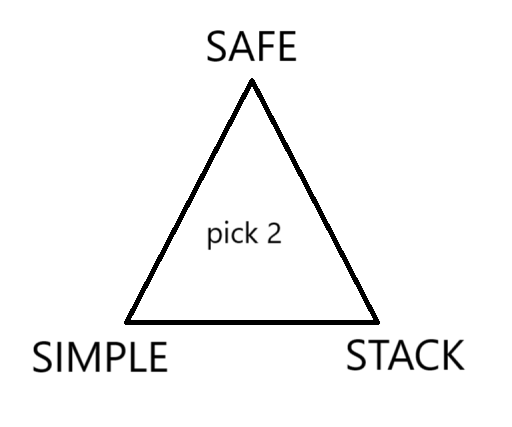
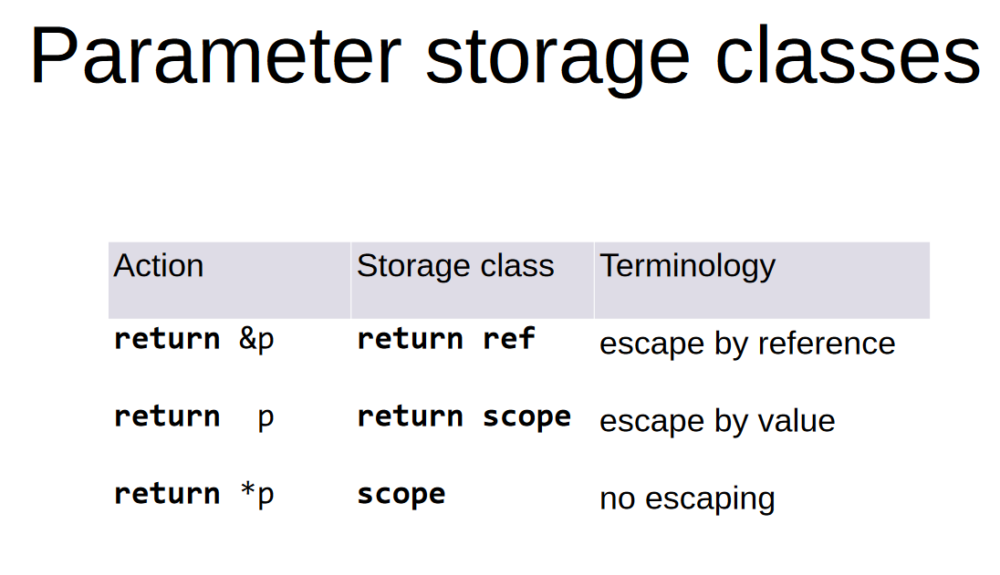
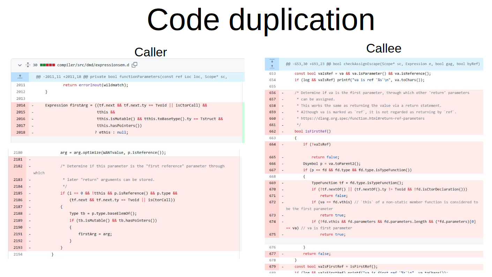
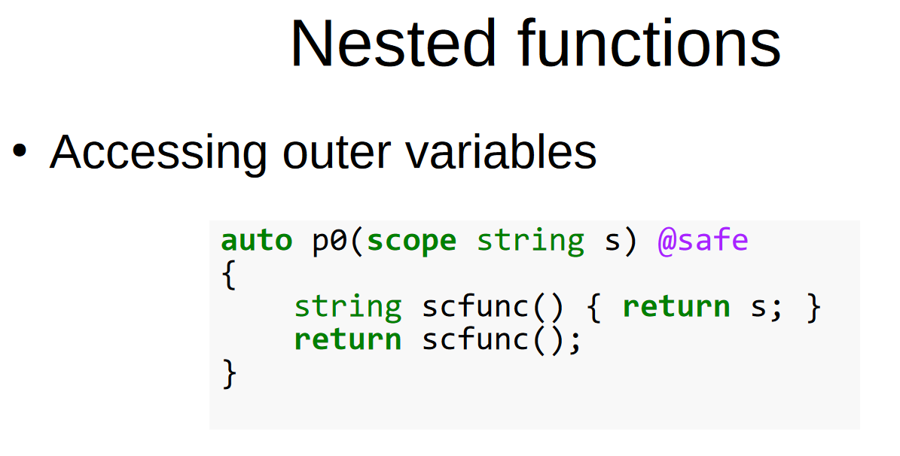
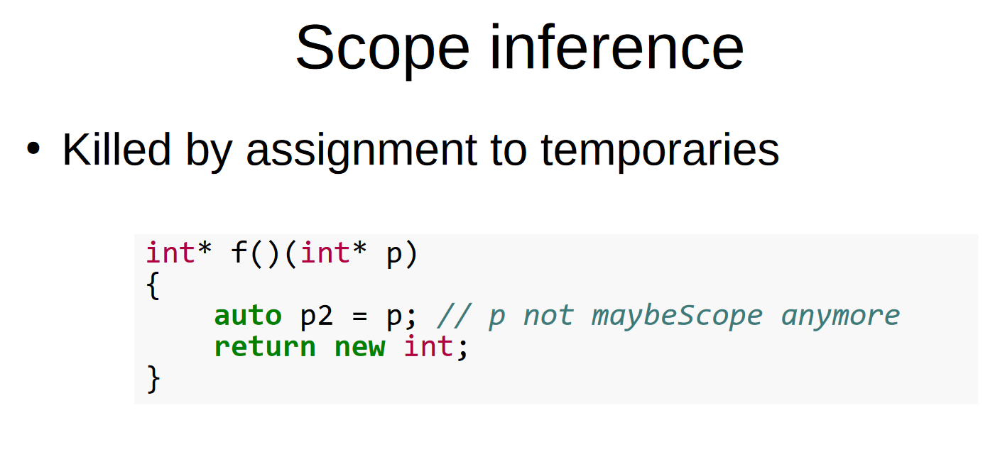
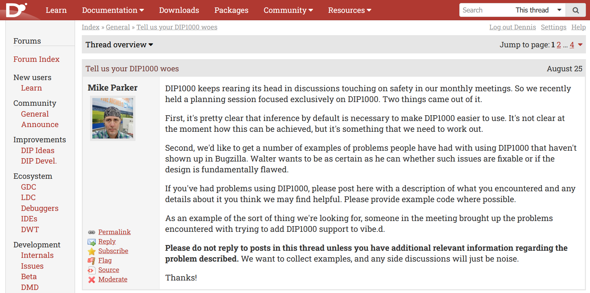

---
marp: true
theme: uncover
title: DIP1000 update
_class: lead
paginate: true
backgroundColor: #f8fff4
header: 'https://github.com/dkorpel/dconf'
math: mathjax

-----------------------------------------------------------

<!-- https://github.com/marp-team/marpit/tree/main/docs -->
<!-- https://github.com/marp-team/marpit/blob/main/docs/image-syntax.md -->

### Avoid the GC in 80 lines DX
Dennis Korpel
<!--_header: DConf'24 London - September 17 2024-->
<!--_footer: -->
<!--_paginate: hide-->
-----------------------------------------------------------



-----------------------------------------------------------
### Today: hole in `@safe`

```D
int[] escape() @safe
{
    int[3] buf;
    int[] slice = buf[];
    return slice; // Bug in safe: this is allowed
}
```
-----------------------------------------------------------
### With -preview=dip1000: `scope` checks

```D
int[] escape() @safe
{
    int[3] buf;
    int[] slice = buf[]; // Allowed, `scope` is inferred
    return slice; // Error: scope variable `slice` may not be returned
}
```

-----------------------------------------------------------
### Robert's Simple `@safe` D (proposal)

```D
int[] escape() @safe
{
    int[3] buf;
    int[] slice = buf[]; // Error: can't take address
    return slice;
}
```
-----------------------------------------------------------

# Editions

- Default: simple safe / dip1000?
- Explicit `scope` opt in?

-----------------------------------------------------------



-----------------------------------------------------------
# DIP1000 issues

-----------------------------------------------------------


-----------------------------------------------------------
### Code duplication got reduced

* I refactored `dmd/escape.d` this year
* Number of `if` statements 310 ⇒ 240
* In better shape to fix / improve
* Still more complex than necessary

-----------------------------------------------------------


-----------------------------------------------------------


-----------------------------------------------------------
### Ref locals are initialized once

```D
auto f(int* p)
{
    ref p2 = p;
    return new int;
}
```

-----------------------------------------------------------
### Bugzilla 23300 is fixed

std.array : array wrongly propagates scopeness of source

```D
int[] fun() @safe
{ 
    import std : array, map;
    scope r = [1,2,3].map!"a+3";
    return r.array;
}
```

<!-- _footer: https://issues.dlang.org/show_bug.cgi?id=23300-->

-----------------------------------------------------------
## Want inference by default

Or at least opt-in?
```D
auto:

int[] identity(int[] x) => x;
int* addrOf(ref int x) => &x;

// Error: function `onlineapp.identity` 
// storage class `auto` has no effect if return type is not inferred
```

-----------------------------------------------------------
## Want partial / transitive scope

```D
struct CtodContext
{
    string source;
    HashMap!(string, Declaration) symbolTable;
    // ...
}
```

- Better inference can be done transparently
- But how much `scope[...]` syntax do we want?

-----------------------------------------------------------

Rikki's new syntax proposal

```D
int** intRefOutPtr(@escape(return&) ref int* input) => &input;
```

<!-- _footer: https://gist.github.com/rikkimax/18563106f610a2daa069c635079a955c/13f84866c82d66dacd9a32039e96cb4aa0243a1f -->

-----------------------------------------------------------

### Share your opinion


<!-- _footer: https://forum.dlang.org/thread/lunzanrfkklespwttyuy@forum.dlang.org-->

-----------------------------------------------------------



<!-- _footer: https://forum.dlang.org/thread/xvzzmgwibbjhuvmnhrgi@forum.dlang.org-->
