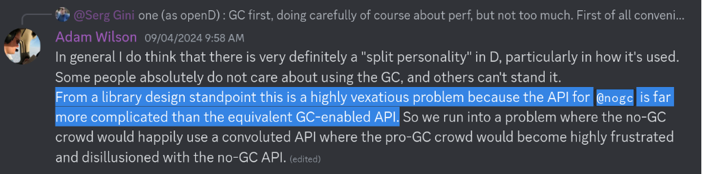

## Avoid the Garbage Collector in 80 lines
Dennis Korpel

---
# Garbage Collection
Memory is automatically managed by occasionally pausing all threads and scanning for memory still in use, and freeing the rest.*

---
# Phobos API
```D
import std.stdio, std.process;

void printPath()
{
    string s = environment.get("PATH");
    writeln(s);
}

```
---
# Windows API
```D
import std.stdio, core.sys.windows.windows;

void printPath()
{
    const lengthZ = GetEnvironmentVariableW("PATH", null, 0);
    wchar[] buf = new wchar[lengthZ];
    const len = GetEnvironmentVariableW("PATH", buf.ptr, buf.length);
    writeln(buf[0 .. len]);
}
```
---
# Conclusion
Thank you Garbage Collector, for the ergonomics you provide

---
<!--_backgroundColor: white-->
<!--_header: ''-->
# <!--fit--> The end
---

# Except...

* Scenarios where you can’t use GC
* I tried various `@nogc` approaches since 2020 so you don’t have to!
* Often awkward, until an epiphany on Dec 2023
* `@safe @nogc` allocator in just 80 lines
* Built on top of malloc + free

---
# r/TQDC


---

```D
import core.memory, core.bitop;

Allocator gc() => Allocator(null);

struct Allocator
{
	AllocatorBase* x;

	T[] array(T)(size_t length) return scope @trusted if (__traits(isPOD, T))
	{
		if (x == null || __ctfe)
			return new T[length];
		return cast(T[]) x.allocate(T.sizeof * length, T.alignof, x);
	}
}

alias AllocateFunction = ubyte[] function(size_t size, size_t alignment, scope void* context);

struct AllocatorBase
{
	immutable AllocateFunction allocate;
}

struct Arena
{
	@system private AllocatorBase base = AllocatorBase(&arenaAllocate);
	@system private ArenaPage* page = null;
	@system private ubyte[] buffer; // slice of free space

	private static ubyte[] arenaAllocate(size_t size, size_t alignment, scope void* ctx) @system =>
		(cast(Arena*) ctx).allocate(size, alignment);

	@disable this(this);
	@disable void opAssign();
```

<!--_footer: https://github.com/dkorpel/dconf/blob/master/dconf24/allocator.d-->

---
# Spoilers
```D
void printPath()
{
    Arena a;
    string s = environmentGet("PATH", a.alloc);
    writeln(s);
    //a.~this();
}

string environmentGet(string key, return scope Allocator alloc = gc)
{
    char[] buf = alloc.array!char(1024);
    // Call OS function
    return buf[0 .. n];
}
```

---
# Whoami
- Msc. Computer Science from TU Delft
- Part time Issue Manager for D Language Foundation
- Part time D programmer at SARC
- 2023: DConf talk about safe stack memory

---
# Contents
- When and why avoid the GC?
- Failed `@nogc` approaches
- The 80 line solution
- Evaluation
- ~~DIP1000~~ scoped pointer updates

---

<!--_backgroundImage: url('https://raw.githubusercontent.com/dkorpel/ctod/master/docs/background.svg')-->
# Why not use GC?

---

# GC API




---

# Controversy

- “GC Phobia”
- Always about those darn collection times
- Every GC allocation might trigger a collection, pausing all threads
- Reference counting better for real-time?
---
# Audio programming

- 48 Khz sample rate, 10 ms latency

```D
float phase = 0;

void audioCallback(float[] buffer)
{
    foreach (i; 0 .. buffer.length)
    {
        buffer[i] = sin(phase);
        phase = (phase + 0.01) % TAU;
    }
}
```
<!--Callback needs to compute 480 samples with a strict deadline-->
---
# Garbage collector comes


- Did you miss the 10 ms deadline?
---
### Guidelines


<!--_footer: The Golden Rules of Audio Programming - Pete Goodliffe - ADC16-->

- No locks
- No malloc
- No file I/O

---

### @nogc should have a reason


---
### @nogc reasons

- It's not there
- Foreign languages
- Complexity

---
<!--_backgroundImage: url('https://raw.githubusercontent.com/dkorpel/ctod/master/docs/background.svg')-->
# Simplicity

---
### 1980s: Linear Congruential Random

```D
int seed = 1;
int rng()
{
    seed = seed * 65539
    return seed;
}
```

---

### 1997: MERSENNE TWISTER

<!--_header: ''-->


---

### 1997: MERSENNE TWISTER

- 624 ints storage
- Default PRNG Excel, Matlab, GNU octave, Phobos
- Fails modern statistical tests

---
### 2014: PCG Random
- More complex than the twister?

```C
uint32_t pcg32_random_r(pcg32_random_t* rng)
{
    uint64_t oldstate = rng->state;
    rng->state = oldstate * 6364136223846793005ULL + (rng->inc|1);
    uint32_t xorshifted = ((oldstate >> 18u) ^ oldstate) >> 27u;
    uint32_t rot = oldstate >> 59u;
    return (xorshifted >> rot) | (xorshifted << ((-rot) & 31));
}
```

---
### Quite Okay Formats

- Dominic Szablewski
- Similar to PNG / MP3
- Encoder / decoder are 400 lines

<!--_footer: https://qoiformat.org/-->

---
### Walter's quote

> Anybody can come up with a a complex solution. A simple one takes genius. You know it's genius when others say: "phui, anyone could have done that!" Except that nobody did.

<!--_footer: https://forum.dlang.org/post/t2i7mg$22am$1@digitalmars.com-->

---
### GC complexity

- Big complex centralized mechanism (7000 lines)
- Requires runtime support
- False pointers on 32-bit
- GC.addRoot
- Virus scanners

---
### Automatic Reference Counting

- Cycle detection
- Copy constructors
- __mutable
- Borrows (dip1021)
- Move optimizations

---
<!--_backgroundImage: url('https://raw.githubusercontent.com/dkorpel/ctod/master/docs/background.svg')-->
## 6 suboptimal `@nogc` solutions

---
### 0. Manually free

```D
void main()
{
    string s = toString('W');
    scope(exit)
        free(s.ptr);
    // use s
}
```

- Not memory safe (dangling pointers)
- Clutters code (esp. unittests and scripts)

---
### 1. Don’t allocate

- Return lazy ranges
- Works for simple algorithms (splitter, chain)
- Primes: 80 LOC for range, 40 for procedural
- `std.path: buildPath`

---
### 2. Stack memory
- Automatically cleans up
- Can’t return it
```D
char[] toString(char i)
{
    char[3] buf = "' '";
    buf[1] = i;
    return buf[]; // Error
}
```
---
### 2. Stack memory
- Small, fixed sizes only
```D
void main()
{
    char[4] buf;
    const n = toString(buf[]);
    const str = buf[0 .. n];
}
```

---
### 3. OutputRanges / Appenders

```D
void toString(O)(ref O sink, char c)
{
    import std.range: put;
    put(sink, "'");
    put(sink, [c]);
    put(sink, "'");
}

void main()
{
    Appender!string appender;
    toString('W', appender);
    string result = a.data();
}
```

---
### 3. OutputRanges / Appenders

- Annoying to write / call
- Still need a `@nogc` Appender
- Hard to make `@safe`

---
### 4. Null garbage collection

> ~~Memory is automatically managed by occasionally pausing all threads and scanning for memory still in use, and freeing the rest.*~~

- That's like saying: The fire department's job is to drive around in a truck, spraying water

---
### 4. Null garbage collection

- "Pretend there's infinite memory"
- Null garbage collector: never deallocate
- Works if enough RAM

---

<!--_footer: https://devblogs.microsoft.com/oldnewthing/20180228-00/?p=98125-->

```
From: k...@rational.com (Kent Mitchell)
Subject: Re: Does memory leak?
Date: 1995/03/31

Norman H. Cohen (nco...@watson.ibm.com) wrote:
: The only programs I know of with deliberate memory leaks are those whose
: executions are short enough, and whose target machines have enough
: virtual memory space, that running out of memory is not a concern.
: (This class of programs includes many student programming exercises and
: some simple applets and utilities; it includes few if any embedded or
: safety-critical programs.)

This sparked an interesting memory for me.  I was once working with a
customer who was producing on-board software for a missile.  In my analysis
of the code, I pointed out that they had a number of problems with storage
leaks.  Imagine my surprise when the customers chief software engineer said
"Of course it leaks".  He went on to point out that they had calculated the
amount of memory the application would leak in the total possible flight time
for the missile and then doubled that number.  They added this much
additional memory to the hardware to "support" the leaks.  Since the missile
will explode when it hits its target or at the end of its flight, the
ultimate in garbage collection is performed without programmer intervention.

--
Kent Mitchell                   | One possible reason that things aren't
Technical Consultant            | going according to plan is .....
Rational Software Corporation   | that there never *was* a plan!
```

---

### 4. Null garbage collection


---
### 5. Scope Array

```D
void f()
{
    size_t length = 500;
    auto sa = ScopeArray!char(length);

    scope char[] buf = sa.getSlice();

    writeln(buf[0 .. 5]);

    // sa.~this();
}
```

---
### 5. Scope Array

```D
void f()
{
    size_t length = 500;
    auto sa = Arena();

    scope Allocator alloc = sa.allocator();

    int[] a = alloc.newArray!int(length);

    // sa.~this();
}
```

---

# The 80 line solution
---

#

```D
struct Allocator
{
    AllocatorBase* x;
}

struct AllocatorBase
{
    immutable AllocateFunction allocate;
}

alias AllocateFunction = ubyte[] function(size_t size, size_t alignment, scope void* context);
```

Did you just re-invent classes and delegates?
(Yes, for C compatibility)

---

# Arenas

- Our own stack
- But accessed through a variable
- Bump the pointer to allocate
- Throw everything out at the end

---

- `malloc` ⟺ `free`
- `ITypeinfo.GetFuncDesc` ⟺ `ReleaseFuncDesc`
- `ITypeinfo.GetVarDesc` ⟺ `ReleaseVarDesc`
- `ITypeinfo.GetNames` ⟺ ~~`ReleaseNames`~~ `SysFreeString`
- `IMoniker.GetDisplayName` ⟺ ~~`SysFreeString`~~ `CoTaskMemFree`

---

# Hannah Montana functions

```D
string environmentGet(string key, Allocator alloc = gc)
{
    char[] buf = alloc.array!char(1024);
    // Call OS function
    return buf[0 .. n];
}
```

---

# Hannah Montana functions

```D
void main()
{
    string s = environmentGet("PATH");

    Arena a;
    string s = environmentGet("PATH", a.alloc);
}
```

- Best of both worlds!

---

# BUT WHAT ABOUT

---

# `@nogc`

- Unlike `return scope` for lifetimes, there’s no `@inout_nogc`
- Cheat: pretend it is `@nogc`
- Hot take: `@nogc` should not be part of function type
- Linting tool instead

---
# Ranges

- Works! See `dconf24/ex2_range.d`

```D
struct Range
{
    Allocator allocator;
}
```

---
# Dynamic arrays

```D
struct Array(T)
{
    T[] slice;
    size_t capacity;
    Allocator alloc;
}
```

---
# Overhead

- GC also has 2-3x overhead...
- Use memory mapping instead of linked list
- 35 bits of real RAM (16 GB)
- 48 bits virtual address space 256 TB
- Stack already does this (2000 threads * 8 MB)

---
# Unpredictable lifetimes

- What if allocation depends on user input?
- Pre-allocate a pool
- Use your own free-list, bitmapped block, ...

---

## Aftermath

- Deleted tons of:
- destructors
- `free` calls
- `// #BAD_TRUSTED` comments

### As well as:
- `ScopeArray`
- `Appender` (merged with `Array`)
