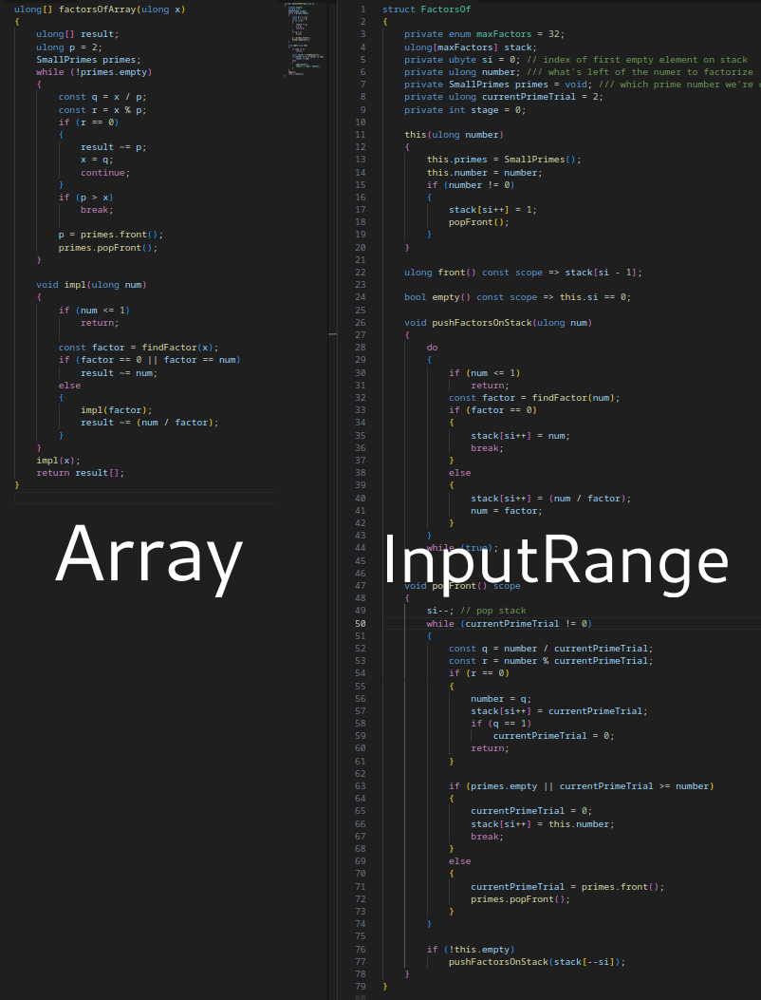

---
marp: true
theme: uncover
title: Avoid the Garbage Collector in 80 lines
_class: lead
paginate: true
backgroundColor: #f8fff4
header: 'https://github.com/dkorpel/dconf'
math: mathjax

-----------------------------------------------------------

<!-- https://github.com/marp-team/marpit/tree/main/docs -->
<!-- https://github.com/marp-team/marpit/blob/main/docs/image-syntax.md -->


### Avoid the Garbage Collector in 80 lines
Dennis Korpel
<!--_header: DConf'24 London - September 17 2024-->
<!--_footer: -->
<!--_paginate: skip-->
-----------------------------------------------------------
# Garbage Collection
Memory is automatically managed by occasionally pausing all threads and scanning for memory still in use, and freeing the rest.<span data-marpit-fragment="1">*</span>

<!--_footer: \\*we'll get back to this-->

-----------------------------------------------------------
# Phobos API
```D
import std.stdio, std.process;

void printPath()
{
    string s = environment.get("PATH");
    writeln(s);
}
```
-----------------------------------------------------------
# Windows API
```D
import std.stdio, core.sys.windows.windows;

void printPath()
{
    const lengthZ = GetEnvironmentVariableW("PATH", null, 0);
    wchar[] buf = new wchar[lengthZ];
    const len = GetEnvironmentVariableW("PATH", buf.ptr, buf.length);
    writeln(buf[0 .. len]);
}
```
-----------------------------------------------------------
# Conclusion
Thank you Garbage Collector, for the ergonomics you provide 👍

-----------------------------------------------------------
# Except...

* Scenarios where you can’t use GC
* I tried `@nogc` approaches so you don’t have to!
* Often awkward, until epiphany:
* `@safe @nogc` allocator in just 80 lines
* Built on top of `malloc` and `free`

-----------------------------------------------------------


-----------------------------------------------------------
<h1 style="color:white">Spoiler</h1>


<!--_header: ''-->

-----------------------------------------------------------
```D
string environmentGet(string key, return scope Allocator alloc = gc)
{
    // return new char[length];
    return alloc.array!char(length);
}

void printPath()
{
    Arena a;
    string s = environmentGet("PATH", a.alloc);
    writeln(s);
    // a.~this();
}
```
<!--_footer: https://github.com/dkorpel/dconf/blob/master/dconf24/allocator.d-->

-----------------------------------------------------------
# Whoami
* Msc. Computer Science from TU Delft
* Part time Issue Manager for D Language Foundation
* Part time D programmer at SARC
* DConf'23: talk about safe stack memory

-----------------------------------------------------------
# Coming up
* On GC avoidance
* On simplicity
* 6 suboptimal `@nogc` approaches
* The 80 line solution
* Bonus: ~~DIP1000~~ scoped pointers status update

-----------------------------------------------------------

<!--_header: ''-->
# ♻️ On GC avoidance
<!--_paginate: skip-->

-----------------------------------------------------------

# GC Phobia


<!--_footer: https://forum.dlang.org/post/mailman.147.1702920162.3719.digitalmars-d-learn@puremagic.com-->

-----------------------------------------------------------

# Controversy

* Always about those darn pauses
  * Write gates?
  * Reference Counting better for real-time?
* I find myself on neither side of the debate

-----------------------------------------------------------
### (Automatic) Reference counting

```D
struct RefCountedString {
    string* payload;
    int* count;

    this(string s) {
        payload = malloc(s.length);
        count = new int(1);
    }

    this(this) { ++*count; }

    ~this() {
        if (--*count == 0) free();
    }
}
```
-----------------------------------------------------------
### Example: Audio programming

```D
float phase = 0;

void audioCallback(float[] buffer)
{
    foreach (i; 0 .. buffer.length)
    {
        buffer[i] = sin(phase);
        phase += 0.0576;
    }
}
```
48 Khz sample rate, 10 ms latency ⇒ 480 samples
<!--Callback needs to compute 480 samples with a strict deadline-->
-----------------------------------------------------------
# Garbage collector comes!

<span data-marpit-fragment="1">


</span>
<span data-marpit-fragment="2">

Takes several ms to collect

</span>

-----------------------------------------------------------
# Deadline missed?
* No, GC only pauses threads it knows
* Audio thread is already detached
* What if we want to load a sample in audioCallback?
* `std.file` uses GC 😲
* But Reference Counting wouldn't have helped

-----------------------------------------------------------
### Audio guidelines


- No syscalls
- No locks
- No malloc
- No file I/O
<!--_footer: https://youtu.be/SJXGSJ6Zoro?si=F-QLhLi-AME7HDeo-->

-----------------------------------------------------------
### @nogc should have a reason

 ⚠️
<!--_footer: https://github.com/dlang/project-ideas/issues/56-->

-----------------------------------------------------------
### @nogc should have a reason

 ✅
<!--_footer: https://code.dlang.org/packages/dplug-->

-----------------------------------------------------------

<!--_header: ''-->
# 🧶 On simplicity
<!--_paginate: skip-->

-----------------------------------------------------------
### 1960s: Linear Congruential Random


<span data-marpit-fragment="1">

$X_{n+1} = \left( a X_n + c \right)\bmod m$

</span>

<span data-marpit-fragment="2">

```D
int seed = 1;
int RANDU()
{
    seed = seed * 65539 + 0;
    return seed;
}
```

</span>

<!--_footer: https://en.wikipedia.org/wiki/RANDU-->

-----------------------------------------------------------
<!--_color: white-->

<span data-marpit-fragment="1">

# <!--fit--> MERSENNE TWISTER

</span>

<!--_header: ''-->


-----------------------------------------------------------


<!--_header: ''-->
<!--_footer: Visualization by Cmglee, CC-BY-SA-3.0: https://commons.wikimedia.org/wiki/File:Mersenne_Twister_visualisation.svg-->
-----------------------------------------------------------
### 1997: MERSENNE TWISTER
* Solved problems with other PRNGs
* Default PRNG Excel, Matlab, GNU octave
* And Phobos (`MersenneTwisterEngine` in `std.random`)
* Fails TestU01 statistical tests (2007)

<!--_footer: https://en.wikipedia.org/wiki/Mersenne_Twister-->
-----------------------------------------------------------
### 2014: PCG Random
* Passes TestU01 suite
* More complex than the twister?
* Nope, just LCG with good constants and a tweak

<!--_footer: https://www.pcg-random.org/-->

-----------------------------------------------------------
### 2014: PCG Random

- 64 bit seed, 32 bit output
- Most significant bits are most random
- Use them to permute the bits

```
1011101000000010100100100010100010010011010000100010111111011001
10111              |
  | [01000000010100100100010100010010]
  |                |
  +----------(rotate_bits)
                   |
    10100100100010100010010][010000000 ---> output
```
-----------------------------------------------------------
### 2014: PCG Random

```D
uint randomPcg32(ref ulong seed)
{
    const ulong x = seed;
    seed = x * 0x5851F42D4C957F2D + 0x14057B7EF767814F;
    uint xorshifted = cast(uint)(((x >> 18UL) ^ x) >> 27UL);
    uint rot = cast(uint)(x >> 59UL);
    return (xorshifted >> rot) | (xorshifted << ((-rot) & 0b11111));
}
```

<span data-marpit-fragment="1">(`std.random` is 4000 lines)</span>

-----------------------------------------------------------

> Anybody can come up with a a complex solution. A simple one takes genius. You know it's genius when others say: "phui, anyone could have done that!" Except that nobody did.

-Walter Bright

<!--_footer: https://forum.dlang.org/post/t2i7mg$22am$1@digitalmars.com-->
-----------------------------------------------------------
### std.experimental.allocator

* Interface + composable building blocks
* 20 000 lines of code 😲
* Overkill for my purposes

<!--_footer: https://dlang.org/phobos/std_experimental_allocator.html-->

-----------------------------------------------------------
### Reference Counting complexity


* Spawns lots of language features
  * `__mutable` / `__metadata` storage class ([DIP1xxx](https://github.com/RazvanN7/DIPs/blob/Mutable_Dip/DIPs/DIP1xxx-rn.md))
  * Argument Ownership and Function Calls ([DIP1021](https://dlang.org/dips/1021))
* Complicates types
  * `string` vs `RefCountedString`
  * `str` vs `String`

<!--_footer: <audio src="img/RC.mp3" controls loop> -->

-----------------------------------------------------------
### GC complexity

* Simple to use
* Complex to implement
  * Druntime dependency
  * Non-portable
  * Type info / pointer bitmaps
* Issues can arise:
  * (Shared) libraries
  * No WebAssembly implementation (yet)
  * False pointers

-----------------------------------------------------------

<!--_header: ''-->
## ⚠️ 6 suboptimal @nogc solutions
<!--_paginate: skip-->

-----------------------------------------------------------
### 0. Manually free

```D
void main()
{
    string s = environmentGet("PATH");
    scope(exit)
        free(s.ptr);
    writeln(s);
}
```

- Clutters code (esp. unittests and scripts)

-----------------------------------------------------------
### 0. Manually free
* `malloc` ⟺ `free`
* COM programming with `ITypeInfo` and `IMoniker`:
* `GetFuncDesc` ⟺ `ReleaseFuncDesc`
* `GetVarDesc` ⟺ `ReleaseVarDesc`
* `GetNames` ⟺ <span data-marpit-fragment="6">`SysFreeString`</span>
* `GetDisplayName` ⟺ <span data-marpit-fragment="7">`CoTaskMemFree`</span>
-----------------------------------------------------------
### 0. Manually free

Documentation suggests `IMalloc::Free`

```D
void getString(IMoniker moniker, IBindCtx ctx)
{
    BSTR displayName;       
    moniker.GetDisplayName(ctx, null, &displayName);

    writeln(displayName.fromStringz);

    IMalloc allocator;
    CoGetMalloc(1, &allocator);
    allocator.Free(displayName);
    allocator.release();
}
```
-----------------------------------------------------------
### 0. Manually free

* Simple (if you don't go nuts)
* Risky (memory leaks, double free)
* `@live` functions offer some protection
  * But doesn't distinguish GC/malloc pointers

<!--_footer: https://dlang.org/blog/2019/07/15/ownership-and-borrowing-in-d/-->
-----------------------------------------------------------


The borrow checker makes it safe, right?
```D
void main() @live
{
    int* x = cast(int*) malloc(4);
    free(x);
}
```
-----------------------------------------------------------


Right?
...
```D
void main() @live
{
    int* x = new int;
    free(x); // No error, by design
}
```
-----------------------------------------------------------
### 1. Don’t allocate

```D
void main()
{
    string paths = "C:/dmd;C:/ldc2";
    foreach (string path; paths.splitter(';'))
    {
        writeln(path);
    }
}
```
* Return lazy ranges instead of arrays
* Annoying to write for recursive algorithms

-----------------------------------------------------------
<!--_header: ''-->



-----------------------------------------------------------
### 1. Don’t allocate

- Voldemort Types can be annoying

```D
import std.stdio, std.path;

void main()
{
    File f = File(withExtension("basilisk", ".txt"));
    // Error: none of the overloads of `this` are
    // callable using argument types `(Result)`

    import std.array;
    File g = File(withExtension("basilisk", ".txt").array);
}
```

-----------------------------------------------------------
### 2. Stack memory

- Automatically cleaned up
- Can’t return it
```D
char[] environmentGet(string var)
{
    char[1024] buf = void;
    // GetEnvironmentVariable(var, buf[]);
    return buf[]; // Error
}
```
-----------------------------------------------------------
### 2. Stack memory

- Annoying to call
- Small, fixed sizes only

```D
void main()
{
    char[1024] buf;
    const str = environmentGet("PATH", buf[]);
}
```

* Should lookup actual max size (32767 on Windows)

-----------------------------------------------------------
### 3. OutputRanges / Appenders

```D
void environmentGet(O)(string name, ref O sink)
{
    import std.range: put;
    put(sink, "...");
}

void main()
{
    import std.array : Appender;

    Appender!string appender;
    environmentGet("PATH", appender);
    string result = appender.data;
}
```

-----------------------------------------------------------
### 3. OutputRanges / Appenders

* Annoying to write
* Annoying to call (doesn't compose)
  * Can't do `environmentGet("PATH").splitter(';')`
* Still need a `@nogc` Appender
* Hard to make `@safe`

-----------------------------------------------------------
### 4. Null garbage collection

> ~~Memory is automatically managed by occasionally pausing all threads and scanning for memory still in use, and freeing the rest.~~

-----------------------------------------------------------
### 4. Null garbage collection

- "Everybody thinks about garbage collection the wrong way" - Raymond Chen
- Garbage collection is simulating a computer with an infinite amount of memory
- Null garbage collector: never deallocate
- Works if enough RAM

<!--_footer: https://devblogs.microsoft.com/oldnewthing/20100809-00/?p=13203 -->

-----------------------------------------------------------
### 4. Null garbage collection

Amusing story from Kent Mitchell


<!--_footer: https://devblogs.microsoft.com/oldnewthing/20180228-00/?p=98125 -->

----------------------------------------------------------

### 4. Null garbage collection

* DMD does this (unless `dmd -lowmem`)
* "Out Of Memory" risk
* Separate compilation required if not enough RAM
* ctod does this for WebAssembly

<!--_footer: https://dkorpel.github.io/ctod -->

-----------------------------------------------------------
### 5. Scope Array

* Extension of stack memory
* Struct containing a static array
* For larger sizes, heap allocate
* Examples:
  * `std.internal.string: tempCString`
  * `dmd.common.string: SmallBuffer`

-----------------------------------------------------------
### 5. Scope Array

```D
struct ScopeArray(T)
{
    T[32] stackMem;
    T[] big;

    this(size_t length)
    {
        if (length > stackMem.length)
            big = malloc(T.sizeof * length);
    }

    T[] opIndex() => big ? big[] : stackMem[];

    ~this() { if (big.ptr) free(big.ptr); }
}
```

-----------------------------------------------------------
### 5. Scope Array

Length must be given upfront
```D
void main()
{
    auto a = ScopeArray!char(length: 1024);

    char[] path = environmentGet("PATH", a[]);

    writeln(path);

    // a.~this();
}
```

-----------------------------------------------------------
### 5. Scope Array

Unless... 🤔
```D
void main()
{
    auto a = Arena();

    char[] path = environmentGet("PATH", &a);

    writeln(path);

    // a.~this();
}
```

-----------------------------------------------------------

<!--_header: ''-->
# 🏟️ The 80 line solution
<!--_paginate: skip-->
-----------------------------------------------------------
# Arenas

```D
struct Arena
{
    ubyte[] buffer;
    ArenaPage* page = null;
}

struct ArenaPage
{
    ArenaPage* previous;
    // variable number of bytes follow
}
```

-----------------------------------------------------------

  <style>
    .svg-diagram {
      font-family: monospace;
      display: block;
      margin: 0 auto;
      width: auto;
      height: 90%;
    }

    .memory-arena {
      fill: none;
      stroke: #333;
      stroke-width: 1;
    }

    .arena-struct {
      fill: #cef;
      stroke: #333;
      stroke-width: 1;
    }

    .allocation {
      fill: #EED;
      stroke: #333;
      stroke-width: 1;
    }

    .allocation-fail {
      fill: none;
      stroke: #811;
      stroke-dasharray: 8;
      stroke-width: 1;
    }

    .arrow {
      fill: none;
      stroke: #777;
      stroke-width: 2;
    }

    .dash-line {
      fill: none;
      stroke: #777;
      stroke-width: 2;
      stroke-dasharray: 8;
    }


  </style>

<svg class="svg-diagram" viewBox="0 0 680 500">

  <g>
    <rect class="memory-arena" x="50" y="50" width="120" height="150" />
    <text x="50" y="40" font-size="16">Stack buffer</text>
  </g>

  <g data-marpit-fragment="1">
    <rect class="allocation" x="60" y="60" width="100" height="50" />
    <text x="70" y="80" font-size="12">D3CCA32C</text>
    <text x="70" y="90" font-size="12">5DCA0528</text>
    <text x="70" y="100" font-size="12">0B382238</text>
  </g>
  <g data-marpit-fragment="2">
    <rect class="allocation" x="60" y="110" width="100" height="40" />
    <text x="70" y="130" font-size="12">7D906630</text>
    <text x="70" y="140" font-size="12">BD79AE22</text>
  </g>
  <g data-marpit-fragment="3">
    <rect class="allocation-fail" x="60" y="150" width="100" height="80" />
  </g>

  <g data-marpit-fragment="4">
    <text x="50" y="270" font-size="16">malloc()</text>
    <rect class="memory-arena" x="50" y="280" width="120" height="150" />
    <rect class="allocation" x="60" y="290" width="100" height="20"/>
    <text x="70" y="304" font-size="12">null</text>
  </g>
  <g data-marpit-fragment="5">
    <rect class="allocation" x="60" y="310" width="100" height="80" />
    <text x="70" y="330" font-size="12">7D906630</text>
    <text x="70" y="340" font-size="12">BD79AE22</text>
    <text x="70" y="350" font-size="12">62B4D675</text>
    <text x="70" y="360" font-size="12">8D475B4C</text>
    <text x="70" y="370" font-size="12">2F4890E8</text>
    <text x="70" y="380" font-size="12">E33D4B24</text>
  </g>
  <g data-marpit-fragment="6">
    <rect class="allocation-fail" x="60" y="390" width="100" height="60" />
  </g>

  <g data-marpit-fragment="6">
    <text x="210" y="270" font-size="16">malloc()</text>
    <rect class="memory-arena" x="200" y="280" width="120" height="130" />
    <rect class="allocation" x="210" y="290" width="100" height="20" />
    <text x="220" y="304" font-size="12">0x7820A8</text>
    <line class="arrow" x1="160" y1="299" x2="210" y2="299" />
    <text class="arrow" x="160" y="304" font-size="16"><</text>
  </g>

  <g data-marpit-fragment="7">
    <rect class="allocation" x="210" y="310" width="100" height="60" />
    <text x="220" y="330" font-size="12">5B4C8D47</text>
    <text x="220" y="340" font-size="12">90E82F48</text>
    <text x="220" y="350" font-size="12">4B24E33D</text>
    <text x="220" y="360" font-size="12">2F4890E8</text>
  </g>

  <g data-marpit-fragment="8">
    <text x="360" y="270" font-size="16">malloc()</text>
    <rect class="memory-arena" x="350" y="280" width="120" height="210" />
    <rect class="allocation" x="360" y="290" width="100" height="20" />
    <text x="370" y="304" font-size="12">0x741BB0</text>
    <line class="arrow" x1="310" y1="299" x2="360" y2="299" />
    <text class="arrow" x="310" y="304" font-size="16"><</text>
  </g>
  <g data-marpit-fragment="9">
    <rect class="allocation" x="360" y="310" width="100" height="80" />
    <text x="370" y="330" font-size="12">475B4C8D</text>
    <text x="370" y="340" font-size="12">4890E82F</text>
    <text x="370" y="350" font-size="12">3D4B24E3</text>
    <text x="370" y="360" font-size="12">E82F4890</text>
    <text x="370" y="370" font-size="12">F4E82890</text>
    <text x="370" y="380" font-size="12">0E82F489</text>
  </g>

  <g data-marpit-fragment="10">
    <rect class="allocation" x="360" y="390" width="100" height="30" />
    <text x="370" y="410" font-size="12">82F4890E</text>
  </g>

  <g data-marpit-fragment="11">
    <text x="560" y="270" font-size="16">Arena</text>
    <rect class="arena-struct" x="550" y="280" width="120" height="80" />
    <rect class="allocation" x="560" y="290" width="100" height="20" />
    <rect class="allocation" x="560" y="310" width="100" height="40" />
    <text x="570" y="304" font-size="12">page</text>
    <text x="570" y="324" font-size="12">buffer</text>
    <line class="arrow" x1="460" y1="299" x2="560" y2="299" />
    <text class="arrow" x="460" y="304" font-size="16"><</text>
    <line class="arrow" x1="460" y1="420" x2="560" y2="330" />
    <line class="arrow" x1="460" y1="480" x2="560" y2="330" />
    <line class="dash-line" x1="460" y1="480" x2="460" y2="420" />

  </g>
</svg>

-----------------------------------------------------------
# Small buffer optimization

```D
void heap()
{
    Arena a;
    ubyte[] res = a.allocate(100); // heap allocates
}

void stack()
{
    ubyte[512] buf = void;
    Arena a = Arena(buf[]);
    ubyte[] res = a.allocate(100); // uses stack buffer
}
```

<!--_footer: See example ex3_stringz.d-->

-----------------------------------------------------------

## Allocator interface

* Arena could be passed around by `ref` or pointer
* But we want something easy and extensible

```D
abstract class Allocator
{
    ubyte[] allocate(size_t size, size_t alignment);
}

class Arena : Allocator;
class GcAllocator : Allocator;
class FailAllocator : Allocator;
```

-----------------------------------------------------------

```D
struct Allocator
{
    AllocatorBase* x;
}

struct AllocatorBase
{
    immutable AllocFunc allocate;
}

alias AllocFunc = ubyte[] function(size_t size, size_t alignment, void* this_);

struct Arena
{
    AllocatorBase base; // Old school struct inheritance
    ubyte[] buffer;
    ArenaPage* page;
}
```

-----------------------------------------------------------

### Why are you re-inventing classes?

* No druntime dependency
* Reduce redundant pointers
* C compatibility
* Implementing allocators is low-level anyway

-----------------------------------------------------------

```D
struct Arena
{
    Allocator alloc() return => Allocator(&this);
}

struct Allocator
{
    AllocatorBase* base;

    T[] array(T)(size_t length) => cast(T[]) base.allocate(length);
}

void main()
{
    Arena a;
    float[] arr = a.alloc.array!float(128);
}
```

-----------------------------------------------------------
# Allocator parameter

<span data-marpit-fragment="1">

Notice the default argument ⬇️

</span>

```D
string environmentGet(string name, Allocator alloc = gc)
{
    char[] buf = alloc.array!char(32768);

    // const n = GetEnvironmentVariableA(name.toStringz, buf.ptr, buf.length);

    return cast(immutable) buf[0 .. n];
}
```

-----------------------------------------------------------
## "Hannah Montana functions"

```D
void main()
{
    string s = environmentGet("PATH");

    Arena a;
    string s = environmentGet("PATH", a.alloc);
}
```

<span data-marpit-fragment="1">

🎤 Best of both worlds!

</span>

-----------------------------------------------------------
# Safety

```D
// Requires `-preview=dip1000`
string environmentGet(string name, return scope Allocator alloc = gc);

string global;

void main() @safe
{
    global = environmentGet("PATH", gc); // Fine

    Arena a;
    global = environmentGet("PATH", a.alloc); // Error
}
```

-----------------------------------------------------------
# Dynamic arrays

<!--_footer: See `dconf24/ex3_array.d`-->

```D
struct Array(T)
{
    T[] slice;
    size_t capacity;
    Allocator alloc;

    void opOpAssign(string op : "~")(T[] rhs)
    {
        auto newSlice = alloc.array!T(length + rhs.length);
        copy(chain(this.slice, rhs), newSlice);
        this.slice = newSlice;
    }
}
```
-----------------------------------------------------------
# Invalidation

<!--_footer: https://github.com/atilaneves/automem/issues/25-->
```D
void main() @safe
{
    import automem.vector;
    auto vec1 = vector(1, 2, 3);
    int[] slice1 = vec1[];
    vec1.reserve(4096);
    int[] slice2 = vec1[];
}
```

* Just don't invalidate inside a block scope 🙈
-----------------------------------------------------------
# Overhead?

* GC has its own overhead
* Use memory mapping instead of linked list
* Reserve gigabyte for Arena
* Lazily commit pages


-----------------------------------------------------------
# Resources

- Ryan Fleury:
  - [Untangling Lifetimes: The Arena Allocator](https://www.rfleury.com/p/untangling-lifetimes-the-arena-allocator)
  - [Enter The Arena: Simplifying Memory Management](https://www.rfleury.com/p/enter-the-arena-talk)
- Chris Wellons:
  - [Arena allocator tips and tricks](https://nullprogram.com/blog/2023/09/27/)
  - [Arenas and the almighty concatenation operator](https://nullprogram.com/blog/2024/05/25/)

-----------------------------------------------------------
## Usage in my own code

* Deleted tons of destructors and `free()` calls
* Deleted `ScopeArray` and `Appender`
  * (just need `Array`)
* It only gets better
  * generalizes to other scenarios

-----------------------------------------------------------
### GPU Memory mapping

```D
void copying()
{
    float[] data;
    data ~= 3.0;
    data ~= 4.0;
    glBufferSubData(buffer, data);
}

void memoryMapping()
{
    float[] data = glMapBufferRange(buffer, 2 * float.sizeof);
    data[0] = 3.0;
    data[1] = 4.0;
    glUnmapBuffer(buffer);
}
```

-----------------------------------------------------------

### GPU Memory mapping
* map ⋍ alloc, unmap ⋍ free
```D
{
    auto mapper = Mapper(buffer, 2); // Arena
    float[] mappedBuffer = mapper[];

    auto data = Array!float(mappedBuffer, failAllocator);
    data ~= 3.0;
    data ~= 4.0;

    // mapper.~this() unmaps
}
```

-----------------------------------------------------------

```D
GlBuffer buffer;
while (1)
{
    gameStep();

    {
        auto mapper = Mapper(buffer, 2); // Arena
        float[] mappedBuffer = mapper[];

        auto data = Array!float(mappedBuffer, failAllocator);
        data ~= 3.0;
        data ~= 4.0;
        // mapper.~this() unmaps
    }

    glDrawArrays(buffer);
}
```

-----------------------------------------------------------

# But what about `@nogc`

- Unlike `return scope` for lifetimes, there’s no `@inout_nogc`
- DIPs for callback attributes still pending
- Cheat: pretend it is `@nogc`
- Hot take: `@nogc` should not be part of function type
- Linting tool instead

-----------------------------------------------------------
# Ugly signatures

Parameter passing

```D
string environmentGet(string name);

// vs

string environmentGet(string name, return scope Allocator alloc = gc);
```

-----------------------------------------------------------

### Context struct

Language feature of Jai and Odin
```
main :: proc()
{
    context.user_index = 456
    {
        context.allocator = my_custom_allocator()
        context.user_index = 123
        supertramp() // `context` is implicitly passed
    }
    assert(context.user_index == 456)
}
```
<!--_footer: https://odin-lang.org/docs/overview/#implicit-context-system-->

-----------------------------------------------------------

```D
struct Context
{
    Allocator allocator;
    Allocator temp_allocator;
    Assertion_Failure_Proc assertion_failure_proc;
    Logger logger;
    Random_Generator random_generator;

    void* user_ptr;
    ptrdiff_t user_index;

    // Internal use only
    void* _internal;
}
```
<!--_footer: https://github.com/odin-lang/Odin/blob/a25a9e6ebe58510cfac20e1187f41a01ec3ec2b2/base/runtime/core.odin#L434-L446-->

-----------------------------------------------------------


<!--_header: ''-->
## Wrapping up
<!--_paginate: skip-->

-----------------------------------------------------------
### Scoped pointers status update

* Refactored `dmd/escape.d` this year
* Number of `if` statements 310 ⇒ 240
* Nested functions + `scope` still broken
* Confusing `return scope` syntax still here
* `scope` inference still needs work
* Want partial / transitive scope for structs

-----------------------------------------------------------
### Suggested GC strategy
* Write code as if you have infinite memory
* (Optimization for a known future is okay)
* _If_ you need to avoid the GC
  * Replace `new T[]` with `allocator.array!T`
  * Place `Arena` / `Allocator` where needed
  * Use `-preview=dip1000` for `@safe`
  * Otherwise it's `@system`/`@trusted`

-----------------------------------------------------------
### The good and the bad

| Do 😎                    | Don't ☹️                     |
|--------------------------|------------------------------|
| Free big chunks          | Pair each malloc ⟺ free    |
| Free at end of scope     | Manually call free          |
| Return simple values     | Be annoying to call        |

-----------------------------------------------------------

### Takeaways
* GC avoidance should be intentional
* Provide convenient defaults
* Use {} block scopes instead of calls to `free()`
* Extract destructors from parameters / fields
* (IMO) `@nogc` should not be part of function type

-----------------------------------------------------------

# The end

<!--_paginate: skip-->

<p style="font-size: 16px; font-family:arial">
Image credits:
- Missile by Marcus Burns: https://commons.wikimedia.org/w/index.php?curid=120217981, CC BY 3.0
</p>

-----------------------------------------------------------
### Quite Okay Formats

- Dominic Szablewski
- Similar to PNG / MP3
- Encoder / decoder are 400 lines

<!--_footer: https://qoiformat.org/-->

-----------------------------------------------------------
## Partial / transitive scope

```D
struct Context
{
    string source;
    HashMap!(string, Declaration) symbolTable;
    Token[] tokens;
    // ...
}
```

* Inference can be programmed
* But how much `scope[...]` syntax do we want?

-----------------------------------------------------------
## Syntax woes

* `return scope` vs. `scope return` still here
* Inference by default would help
* `ret&` and `retscope`?

-----------------------------------------------------------

### 4. Null garbage collection


<!--_footer: https://youtu.be/bNJhtKPugSQ?si=z-USHbQyKkhrlH9c&t=579 -->
-----------------------------------------------------------
## Context struct


<!--_footer: https://youtu.be/uZgbKrDEzAs?si=clQT4OAd4j66KJ8i&t=2303-->

-----------------------------------------------------------
# Unpredictable lifetimes

* What if allocation depends on user input?
* Pre-allocate a pool
* Roll your own free-list, bitmapped block, GC...

<!--_footer: https://bitbashing.io/gc-for-systems-programmers.html-->
<!--https://forum.dlang.org/post/tnajfjmvvyqardwhxegi@forum.dlang.org-->

-----------------------------------------------------------
## Concatenation

```D
struct Person
{
    string name, surname;
    string toString() const => name ~ " " ~ surname;
}

void main()
{
    char[] s = "Hello " ~ Person("Dennis", "Korpel").toString() ~ "!";
}

// "Dennis "
// "Dennis Korpel"
// "Hello Dennis Korpel"
// "Hello Dennis Korpel!"
```

-----------------------------------------------------------
```
string environmentGet(string key, return scope Allocator alloc = gc)
{
    //int n = GetEnvironmentVariableA(key.ptr, null, 0);
    char[] buf = alloc.array!char(n);
    //GetEnvironmentVariableA(key.ptr, buf.ptr, buf.length);
    return buf[0 .. n];
}
```
-----------------------------------------------------------
### GC complexity


<!--_footer: https://github.com/dlang/dmd/tree/master/druntime/src/core/internal/gc-->
