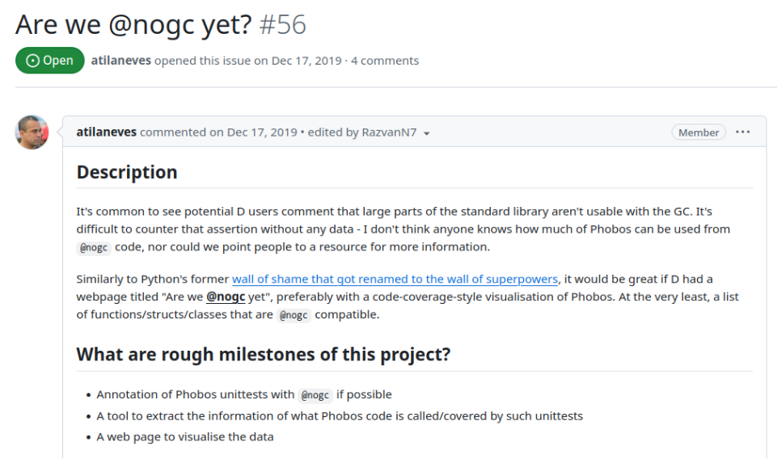

---
marp: true
theme: uncover
title: Avoid the Garbage Collector in 80 lines
_class: lead
paginate: true
backgroundColor: #f8fff4
header: 'https://github.com/dkorpel/dconf'
math: mathjax

-----------------------------------------------------------

### Avoid the Garbage Collector in 80 lines
Dennis Korpel
<!--_header: ''-->

-----------------------------------------------------------
# Garbage Collection
Memory is automatically managed by occasionally pausing all threads and scanning for memory still in use, and freeing the rest.*

<!--_footer: ∗we'll get back to this-->

-----------------------------------------------------------
# Phobos API
```D
import std.stdio, std.process;

void printPath()
{
    string s = environment.get("PATH");
    writeln(s);
}
```
-----------------------------------------------------------
# Windows API
```D
import std.stdio, core.sys.windows.windows;

void printPath()
{
    const lengthZ = GetEnvironmentVariableW("PATH", null, 0);
    wchar[] buf = new wchar[lengthZ];
    const len = GetEnvironmentVariableW("PATH", buf.ptr, buf.length);
    writeln(buf[0 .. len]);
}
```
-----------------------------------------------------------
# Conclusion
Thank you Garbage Collector, for the ergonomics you provide 👍

-----------------------------------------------------------
# Except...

* Scenarios where you can’t use GC
* I tried `@nogc` approaches so you don’t have to!
* Often awkward, until epiphany:
* `@safe @nogc` allocator in just 80 lines
* Built on top of `malloc` and `free`

-----------------------------------------------------------


-----------------------------------------------------------
**Spoiler:**
```D
string environmentGet(string key, return scope Allocator alloc = gc)
{
    char[] buf = alloc.array!char(1024);
    // Call OS function
    return buf[0 .. n];
}

void printPath()
{
    Arena a;
    string s = environmentGet("PATH", a.alloc);
    writeln(s);
    // a.~this();
}
```
<!--_footer: https://github.com/dkorpel/dconf/blob/master/dconf24/allocator.d-->

-----------------------------------------------------------
# Whoami
* Msc. Computer Science from TU Delft
* Part time Issue Manager for D Language Foundation
* Part time D programmer at SARC
* 2023: DConf talk about safe stack memory

-----------------------------------------------------------
# Coming up
* Why not use GC?
* On simplicity
* 6 suboptimal `@nogc` approaches
* The 80 line solution
* ~~DIP1000~~ scoped pointers status update

-----------------------------------------------------------

<!--_header: ''-->

# Why not use GC?

-----------------------------------------------------------

# GC Phobia


<!--_footer: https://forum.dlang.org/post/mailman.147.1702920162.3719.digitalmars-d-learn@puremagic.com-->

-----------------------------------------------------------

# Controversy

* Always about those darn pauses
* I find myself on neither side of the debate
* Reference Counting better for real-time?

-----------------------------------------------------------
### (Automatic) Reference counting

```D
struct RefCountedString {
    string* payload;
    int* count;

    this(string s) {
        payload = malloc(s.length);
        count = new int(1);
    }

    this(this) { ++*count; }

    ~this() {
        if (--*count == 0) free();
    }
}
```
-----------------------------------------------------------
### Example: Audio programming

```D
float phase = 0;

void audioCallback(float[] buffer)
{
    foreach (i; 0 .. buffer.length)
    {
        buffer[i] = sin(phase);
        phase += 0.0576;
    }
}
```
48 Khz sample rate, 10 ms latency ⇒ 480 samples
<!--Callback needs to compute 480 samples with a strict deadline-->
-----------------------------------------------------------
# Garbage collector comes!


Takes several ms to collect

-----------------------------------------------------------
# Deadline missed?
* No, GC only pauses threads it knows
* Audio thread is already 'detached'
* What if we want to load a sample in audioCallback?
* `std.file` uses GC 😲
* But Reference Counting wouldn't have helped

-----------------------------------------------------------
### Audio guidelines


- No syscalls
- No locks
- No malloc
- No file I/O
<!--_footer: The Golden Rules of Audio Programming - Pete Goodliffe - ADC16 https://youtu.be/SJXGSJ6Zoro?si=F-QLhLi-AME7HDeo-->

-----------------------------------------------------------
### @nogc should have a reason

 ⚠️
<!--_footer: https://github.com/dlang/project-ideas/issues/56-->

-----------------------------------------------------------
### @nogc should have a reason

 ✅
<!--_footer: https://code.dlang.org/packages/dplug-->

-----------------------------------------------------------

<!--_header: ''-->
# On simplicity

-----------------------------------------------------------
### 1960s: Linear Congruential Random

$X_{n+1} = \left( a X_n + c \right)\bmod m$


<!--_footer: https://en.wikipedia.org/wiki/RANDU-->
```D
int seed = 1;
int RANDU()
{
    seed = seed * 65539 + 0;
    return seed;
}
```
-----------------------------------------------------------
# <!--fit--> MERSENNE TWISTER

<!--_header: ''-->


-----------------------------------------------------------


<!--_header: ''-->
<!--_footer: Visualization by Cmglee, CC-BY-SA-3.0: https://commons.wikimedia.org/wiki/File:Mersenne_Twister_visualisation.svg-->
-----------------------------------------------------------
### 1997: MERSENNE TWISTER
* 624 ints storage (2 Kb)
* Default PRNG Excel, Matlab, GNU octave, Phobos
* Fails TestU01 statistical tests (2007)
-----------------------------------------------------------
### 2014: PCG Random
* More complex than the twister?
* Nope, just LCG with good constants and a tweak

-----------------------------------------------------------
### 2014: PCG Random

- 64 bit seed, 32 bit output
- Most significant bits are most random
- Use them to permute the bits

```
1011101000000010100100100010100010010011010000100010111111011001
10111              |
  | [01000000010100100100010100010010]
  |                |
  +----------(rotate_bits)
                   |
    10100100100010100010010][010000000 ---> output
```
-----------------------------------------------------------
### 2014: PCG Random

```D
uint randomPcg32(ref ulong seed)
{
    const ulong x = seed;
    seed = x * 0x5851F42D4C957F2D + 0x14057B7EF767814F;
    uint xorshifted = cast(uint)(((x >> 18UL) ^ x) >> 27UL);
    uint rot = cast(uint)(x >> 59UL);
    return (xorshifted >> rot) | (xorshifted << ((-rot) & 0b11111));
}
```

(`std.random` is 4000 lines)

-----------------------------------------------------------

> Anybody can come up with a a complex solution. A simple one takes genius. You know it's genius when others say: "phui, anyone could have done that!" Except that nobody did.

-Walter Bright

<!--_footer: https://forum.dlang.org/post/t2i7mg$22am$1@digitalmars.com-->

-----------------------------------------------------------
### Reference Counting complexity
- `__mutable` / `__metadata` storage class (DIP1xxx)
- Borrows (DIP1021)
- Copying, Moving, and Forwarding (DIP1040)

<!--_footer: https://github.com/RazvanN7/DIPs/blob/Mutable_Dip/DIPs/DIP1xxx-rn.md-->

-----------------------------------------------------------
### GC complexity

* 7000 line implementation in druntime
* Centralized, needs to know everything
* Platform specific details

TODO DIAGRAM

* False pointers on 32-bit
* Missing GC.addRoot
* Virus scanners

-----------------------------------------------------------

<!--_header: ''-->
## 6 suboptimal @nogc solutions

-----------------------------------------------------------
### 0. Manually free

```D
void main()
{
    string s = environmentGet("PATH");
    scope(exit)
        free(s.ptr);
    writeln(s);
}
```

- Clutters code (esp. unittests and scripts)

-----------------------------------------------------------
### 0. Manually free
* `malloc` ⟺ `free`
* COM programming with `ITypeInfo` and `IMoniker`:
* `GetFuncDesc` ⟺ `ReleaseFuncDesc`
* `GetVarDesc` ⟺ `ReleaseVarDesc`
* `GetNames` ⟺ ~~`ReleaseNames`~~ `SysFreeString`
* `GetDisplayName` ⟺ ~~`SysFreeString`~~ `CoTaskMemFree`
-----------------------------------------------------------
### 0. Manually free

- Documentation suggests `IMalloc::Free`

```D
void getString(IMoniker moniker)
{
    BSTR displayName;       
    moniker.GetDisplayName(ctx, null, &displayName);

    writeln(displayName.fromStringz);

    IMalloc allocator;
    CoGetMalloc(1, &allocator);
    allocator.Free(displayName);
    allocator.release();
}
```
-----------------------------------------------------------
### 0. Manually free

* Risky (memory leaks, double free)
* `@live` offers some protection
* Doesn't distinguish GC/malloc pointers

-----------------------------------------------------------


The borrow checker catches this, right?
```D
void main() @live
{
    int* x = cast(int*) malloc(4);
    free(x); ✅
}
```
<!--_footer: https://dlang.org/blog/2019/07/15/ownership-and-borrowing-in-d/-->
-----------------------------------------------------------


Right?
...
```D
void main() @live
{
    int* x = new int;
    free(x); // No error by design
}
```
<!--_footer: https://dlang.org/blog/2019/07/15/ownership-and-borrowing-in-d/-->
-----------------------------------------------------------
### 1. Don’t allocate

```D
void main()
{
    foreach (string path; paths.splitter(':'))
    {
        writeln(path);
    }
}
```
* Return lazy ranges instead of arrays
* Annoying to write for complex algorithms

-----------------------------------------------------------
<!--_header: ''-->


-----------------------------------------------------------
### 1. Don’t allocate

- Voldemort Types can be annoying

```D
import std;

void main()
{
    string s = withExtension("Sonic", ".exe");
}
```

```
Error: cannot implicitly convert expression `withExtension("Sonic", ".exe")` of type `Result` to `string`
```

-----------------------------------------------------------
### 2. Stack memory

* Automatically cleaned up
* Can’t return it
```D
char[] environmentGet(string var)
{
    char[1024] buf = void;
    // GetEnvironmentVariable(var, buf[]);
    return buf[]; // Error
}
```
-----------------------------------------------------------
### 2. Stack memory
* Annoying to call
* Small, fixed sizes only

```D
void main()
{
    char[1024] buf;
    const n = environmentGet(buf[]);
    const str = buf[0 .. n];
}
```

-----------------------------------------------------------
### 3. OutputRanges / Appenders

```D
void environmentGet(O)(string key, ref O sink)
{
    import std.range: put;
    put(sink, "...");
}

void main()
{
    Appender!string appender;
    environmentGet("PATH", appender);
    string result = a.data();
}
```

-----------------------------------------------------------
### 3. OutputRanges / Appenders

* Annoying to write / call
* Still need a `@nogc` Appender
* Hard to make `@safe`

-----------------------------------------------------------
### 4. Null garbage collection

> ~~Memory is automatically managed by occasionally pausing all threads and scanning for memory still in use, and freeing the rest.~~

-----------------------------------------------------------
### 4. Null garbage collection

- "Everybody thinks about garbage collection the wrong way" - Raymond Chen
- Garbage collection is simulating a computer with an infinite amount of memory
- Null garbage collector: never deallocate
- Works if enough RAM

<!--_footer: https://devblogs.microsoft.com/oldnewthing/20100809-00/?p=13203 -->

-----------------------------------------------------------
### 4. Null garbage collection

Amusing story from Kent Mitchell


<!--_footer: https://devblogs.microsoft.com/oldnewthing/20180228-00/?p=98125 -->

-----------------------------------------------------------

### 4. Null garbage collection


<!--_footer: https://youtu.be/bNJhtKPugSQ?si=z-USHbQyKkhrlH9c&t=579 -->

-----------------------------------------------------------

### 4. Null garbage collection

* Porting apps using GC
* No GC implementation for WebAssembly yet
* "Out Of Memory" risk

-----------------------------------------------------------
### 5. Scope Array

```D
struct ScopeArray(T)
{
    T[32] stackMem;
    T[] big;

    this(size_t length)
    {
        if (length > stackMem.size)
            big = malloc(T.sizeof * length);
    }

    T[] opIndex() => big ? big[] : stackMem[];

    ~this() { if (big.ptr) free(big.ptr); }
}
```

-----------------------------------------------------------
### 5. Scope Array
```D
void main()
{
    auto a = ScopeArray!char(length: 1024);

    char[] path = environmentGet("PATH", a[]);

    writeln(path);

    // sa.~this();
}
```

-----------------------------------------------------------
### 5. Scope Array

```D
void main()
{
    auto a = Arena();

    char[] path = environmentGet(buf, &a);

    writeln(path);

    // sa.~this();
}
```

-----------------------------------------------------------
<!--_header: ''-->

# The 80 line solution
-----------------------------------------------------------
# Arenas

```D
struct Arena
{
    ubyte[] buffer;
    ArenaPage* page = null;
}
```


-----------------------------------------------------------
```D
struct Allocator
{
    AllocatorBase* x;
}

struct AllocatorBase
{
    immutable AllocateFunction allocate;
}

alias AllocateFunction = ubyte[] function(size_t size, size_t alignment, scope void* context);
```

Did you just re-invent classes and delegates?
(Yes, for C compatibility)

-----------------------------------------------------------
# Hannah Montana functions

```D
string environmentGet(string key, Allocator alloc = gc)
{
    char[] buf = alloc.array!char(1024);
    // Call OS function
    return buf[0 .. n];
}
```

-----------------------------------------------------------
# Hannah Montana functions

```D
void main()
{
    string s = environmentGet("PATH");

    Arena a;
    string s = environmentGet("PATH", a.alloc);
}
```

- Best of both worlds!

-----------------------------------------------------------
# Safety

```D
// Requires `-preview=dip1000`
string environmentGet(string key, return scope Allocator alloc = gc);

string global;

void main() @safe
{
    global = environmentGet("PATH", gc); // Fine

    Arena a;
    global = environmentGet("PATH", a.alloc); // Error
    string l = environmentGet("PATH", a.alloc); // Inferred `scope`
    global = l; // Error
}
```
-----------------------------------------------------------
# Safety

```D
struct Arena
{
    Allocator alloc() return => Allocator(&this);
}

struct Allocator
{
    AllocatorBase* x;

    T[] make(T)(size_t length) return scope => cast(T[]) x.allocate(length);
}
```
* Using `@system` variables to cheat transitive scope

-----------------------------------------------------------
### The good and the bad/ugly

| Do 😎                    | Don't ☹️                     |
|--------------------------|------------------------------|
| Free big chunks          | Pair each malloc ⟺ free    |
| Free at end of scope     | Manually call free          |
| Return simple values     | Be annoying to call        |

-----------------------------------------------------------

# BUT WHAT ABOUT

-----------------------------------------------------------

# `@nogc`

- Unlike `return scope` for lifetimes, there’s no `@inout_nogc`
- Cheat: pretend it is `@nogc`
- Hot take: `@nogc` should not be part of function type
- Linting tool instead

-----------------------------------------------------------
# Dynamic arrays

- See `dconf24/ex3_array.d`

```D
struct Array(T)
{
    T[] slice;
    size_t capacity;
    Allocator alloc;
}
```

-----------------------------------------------------------
# Overhead

- GC also has 2-3x overhead...
- Use memory mapping instead of linked list
- 35 bits of real RAM (16 GB)
- 48 bits virtual address space 256 TB
- Stack already does this (2000 threads * 8 MB)

-----------------------------------------------------------
# Unpredictable lifetimes

- What if allocation depends on user input?
- Pre-allocate a pool
- Roll your own free-list, bitmapped block, GC...

<!--_footer: https://bitbashing.io/gc-for-systems-programmers.html-->
<!--https://forum.dlang.org/post/tnajfjmvvyqardwhxegi@forum.dlang.org-->
-----------------------------------------------------------
# Ugly signatures

-----------------------------------------------------------
## Context struct


<!--_footer: https://youtu.be/uZgbKrDEzAs?si=clQT4OAd4j66KJ8i&t=2303-->
-----------------------------------------------------------

### In Odin
```
main :: proc()
{
    context.user_index = 456
    {
        context.allocator = my_custom_allocator()
        context.user_index = 123
        supertramp() // `context` is implicitly passed
    }
    assert(context.user_index == 456)
}
```
<!--_footer: https://odin-lang.org/docs/overview/#implicit-context-system-->

-----------------------------------------------------------

```D
struct Context
{
    Allocator allocator;
    Allocator temp_allocator;
    Assertion_Failure_Proc assertion_failure_proc;
    Logger logger;
    Random_Generator random_generator;

    void* user_ptr;
    ptrdiff_t user_index;

    // Internal use only
    void* _internal;
}
```
<!--_footer: https://github.com/odin-lang/Odin/blob/a25a9e6ebe58510cfac20e1187f41a01ec3ec2b2/base/runtime/core.odin#L434-L446-->

-----------------------------------------------------------
## Aftermath

- Deleted tons of destructors and `free()` calls
- Deleted `ScopeArray` and `Appender` (just need `Array`)
- It only gets better

-----------------------------------------------------------
## GPU memory

- No near/far pointers, no Phobos/Tango

-----------------------------------------------------------
```D
GlBuffer buffer = GlBuffer(1000); // glBufferSubdata
GameState game;
while (1)
{
    game.update(pollInput());

    {
        auto mapper = Mapper(buffer);
        auto drawBuffer = Array!float(gpuMem[], failAllocator);

        game.draw(drawBuffer);
        // mapper.~this() unmaps
    }

    glDrawArrays(buffer);
}
```
-----------------------------------------------------------
# Invalidation

<!--_footer: https://github.com/atilaneves/automem/issues/25-->
```D
void main() @safe
{
    import automem.vector;
    auto vec1 = vector(1, 2, 3);
    int[] slice1 = vec1[];
    vec1.reserve(4096);
    int[] slice2 = vec1[];
}
```

* Just don't invalidate inside a block scope 🙈

-----------------------------------------------------------
<!--_header: ''-->


## Wrapping up

-----------------------------------------------------------
### Scoped pointers status update

* Refactored `dmd/escape.d` this year
* Number of `if` statements 310 ⇒ 240
* `scope` inference of `std.array: array` fixed
* Confusing `return scope` syntax still here
* `retref` and `retscope`?
* Want partial / transitive scope for structs

-----------------------------------------------------------
### Suggested GC strategy
* Write code as if you have infinite memory
* (Optimization for a known future is okay)
* _If_ you need to avoid the GC
  * Replace `new T[]` with `allocator.array!T`
  * Place `Arena` / `Allocator` where needed
  * Use `-preview=dip1000` for `@safe`
  * Otherwise it's `@system`/`@trusted`

-----------------------------------------------------------
### Takeaways
* GC avoidance should be intentional
* Hannah Montana functions are cool
* Use {} block scopes instead of calls to `free()`
* Extract destructors from parameters / fields
* (IMO) `@nogc` should not be part of function type

-----------------------------------------------------------

# The end

Image credits:
- Missile by Marcus Burns: https://commons.wikimedia.org/w/index.php?curid=120217981, CC BY 3.0
-

-----------------------------------------------------------
### Quite Okay Formats

- Dominic Szablewski
- Similar to PNG / MP3
- Encoder / decoder are 400 lines

<!--_footer: https://qoiformat.org/-->

-----------------------------------------------------------
## Partial / transitive scope

```D
struct Context
{
    string source;
    HashMap!(string, Declaration) symbolTable;
    Token[] tokens;
    // ...
}
```

* Inference can be programmed
* But how much `scope[...]` syntax do we want?

-----------------------------------------------------------
## Syntax woes

* `return scope` vs. `scope return` still here
* Inference by default would help
* `ret&` and `retscope`?
-----------------------------------------------------------
<!--_header: ''-->
<video src="img/RC.mp4"></video>