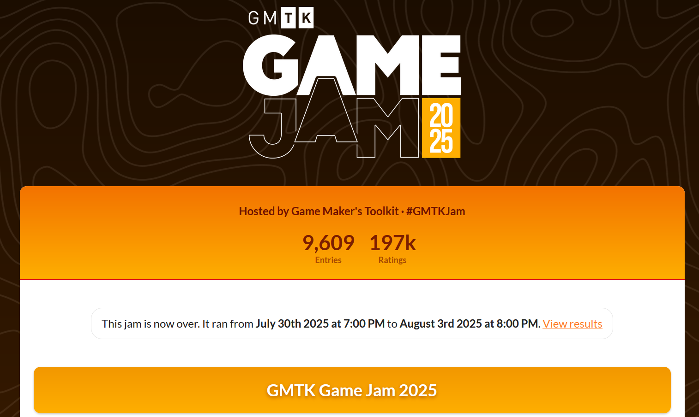

<!-- _footer: https://itch.io/jam/gmtk-2025 --> 

---

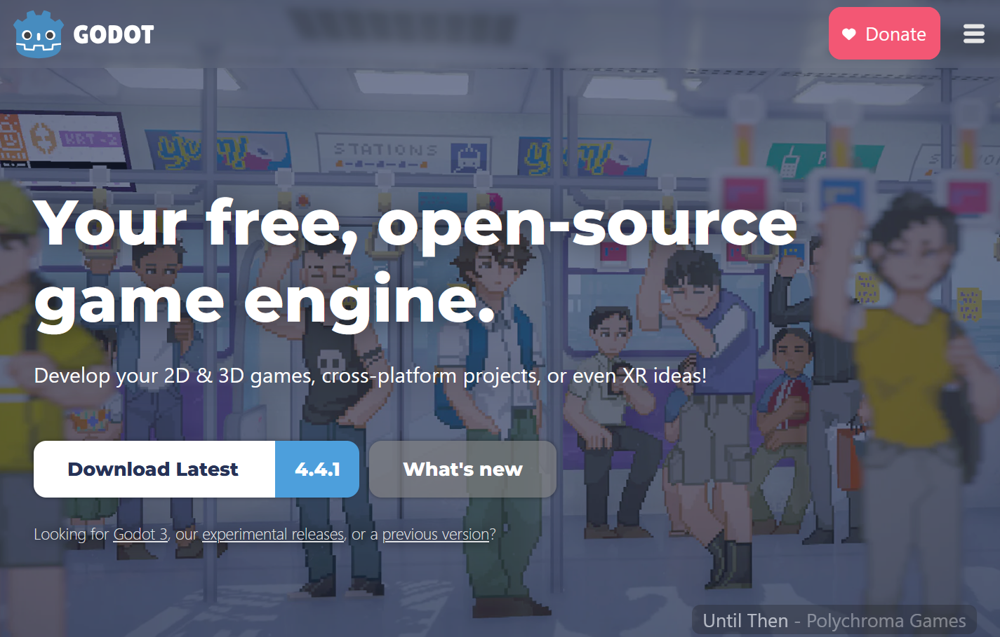
<!-- _footer: https://godotengine.org/ --> 

---

# Godot submissions

<!-- _footer: https://subdomain.itch.io --> 
<!-- _header: https://subdomain.itch.io --> 

- Out of control, 2020
- Joined together, 2021
- Roll of the dice, 2022
- Role reversal, 2023
- Built to Scale, 2024

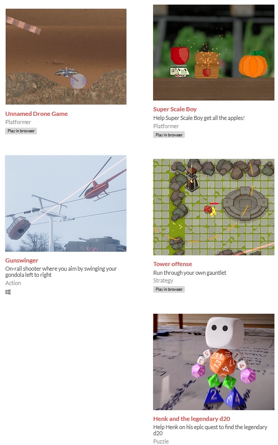

---

<!-- _footer: https://subdomain.itch.io -->
<!-- _header: https://subdomain.itch.io -->

# Issues with Godot

- GDScript (~Python) makes me not want to write code
- 2020: Fiddling with Node2D physics tree, chain of joints unstable
- 2024: Theme=built to-scale, Godot doesn't support dynamic scaling.
- Bloat (40mb empty game)

---


---
# Let's use Rust! 😇😈

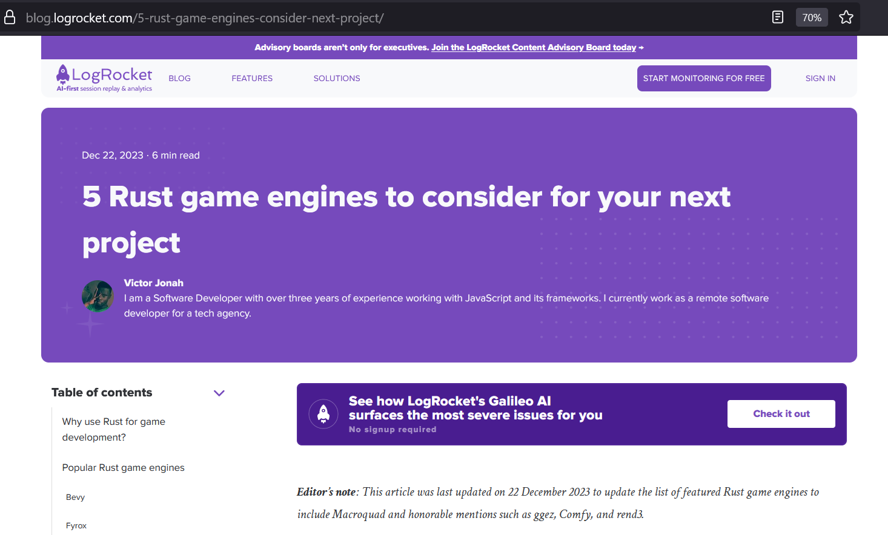

<!-- _header: https://blog.logrocket.com/5-rust-game-engines-consider-next-project/ -->

---

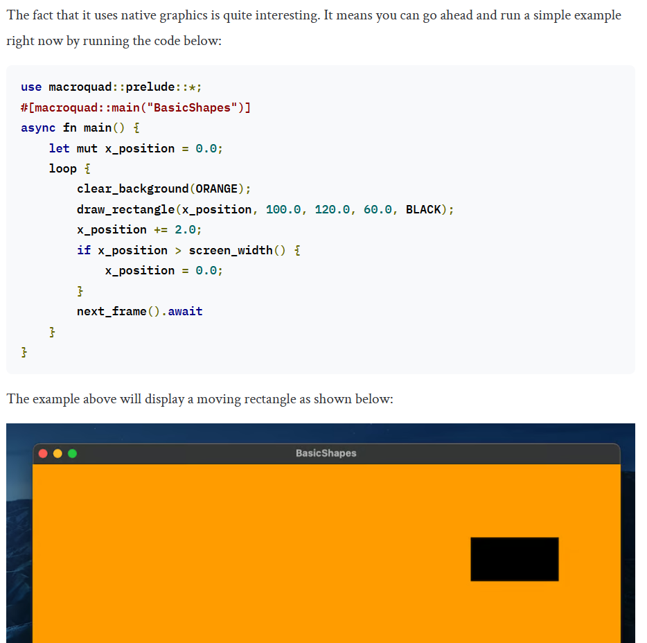

---

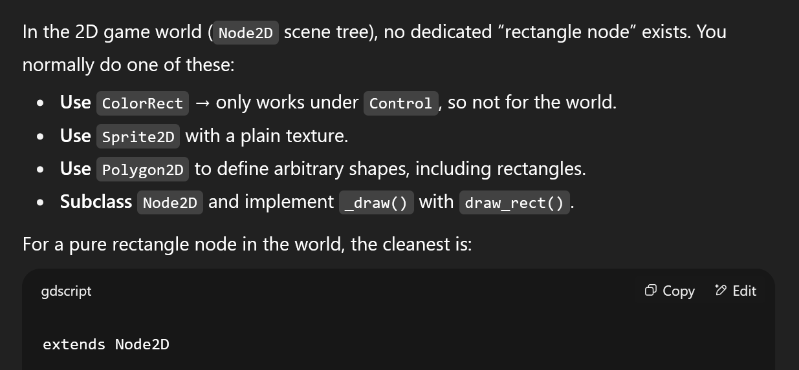

---

### "Bevy is a simple, data-driven game engine."

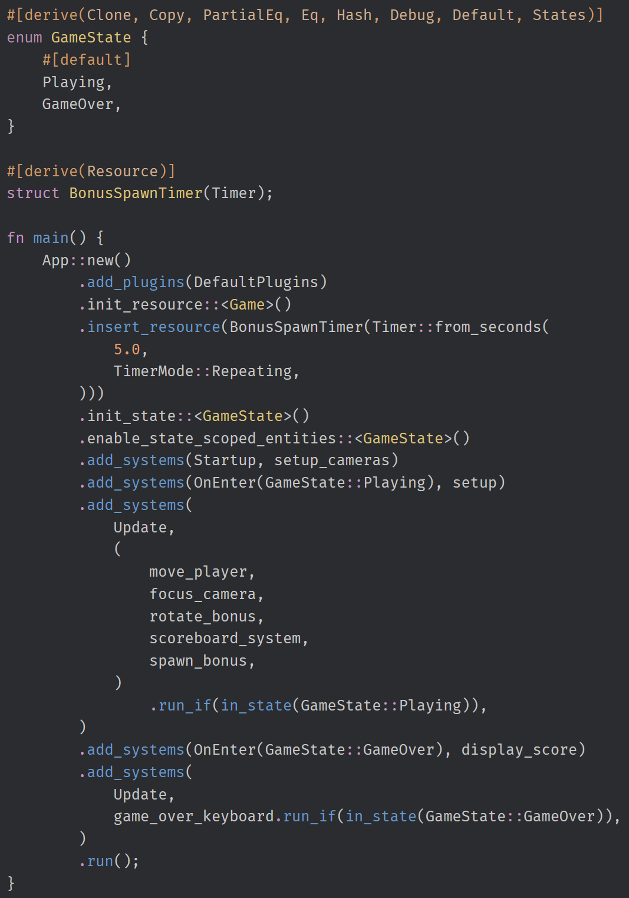

<!-- _footer: https://bevy.org/examples/games/alien-cake-addict/-->

---

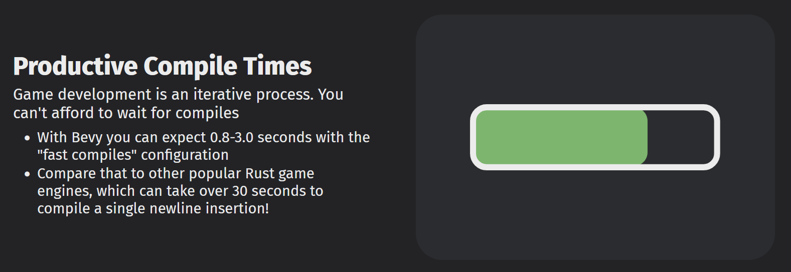

---

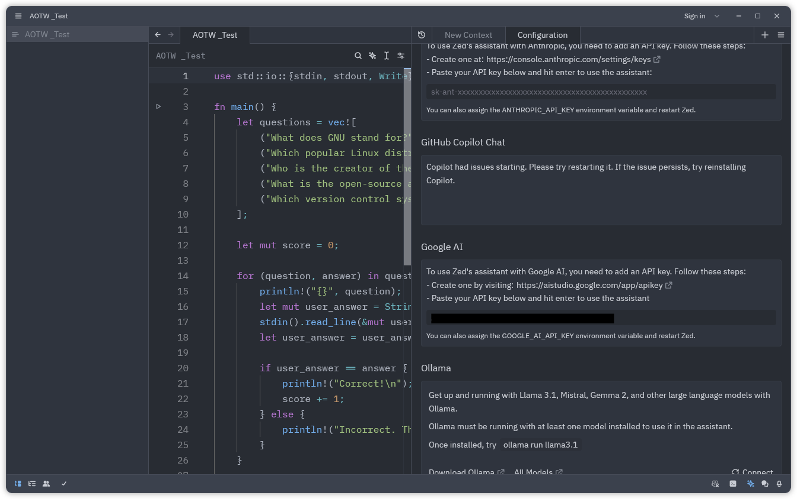

---


---

# Let's use D!
❤️  to Godot and Rust

---

# My D + WebAssembly history

- https://dkorpel.github.io/tictac/ (2018)
- https://dkorpel.github.io/ctod/ (2022)
- https://dkorpel.github.io/dchess (2023)

<div style="display:flex; justify-content:center; gap:20px;">
  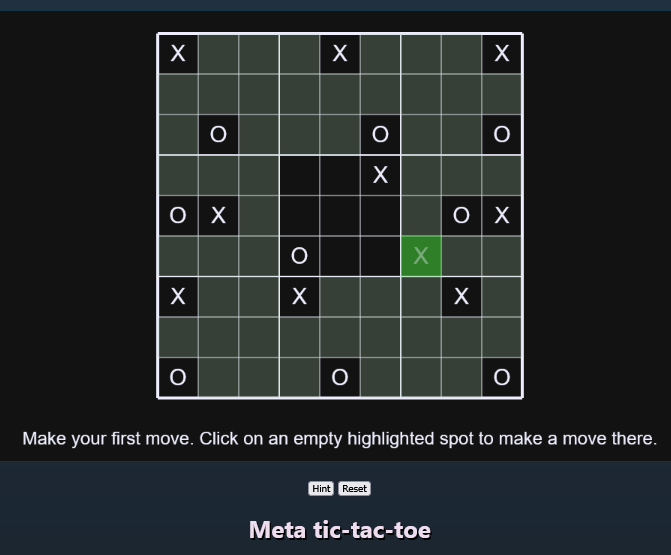
  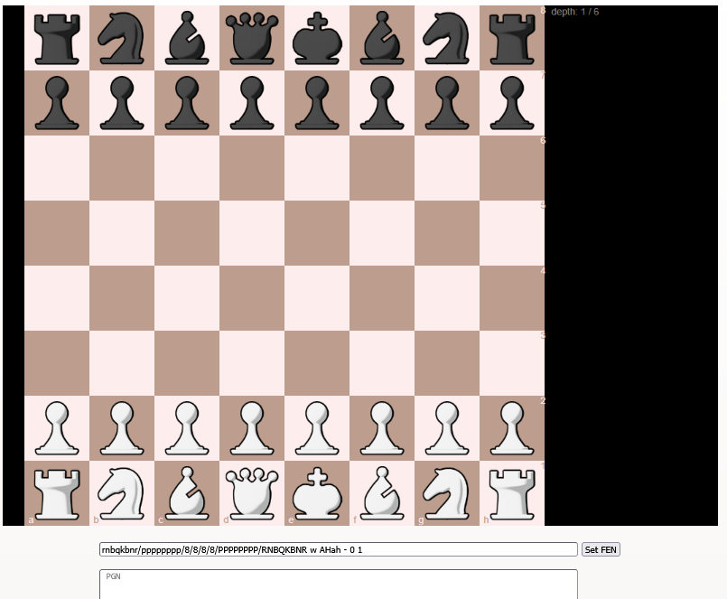
</div>

---

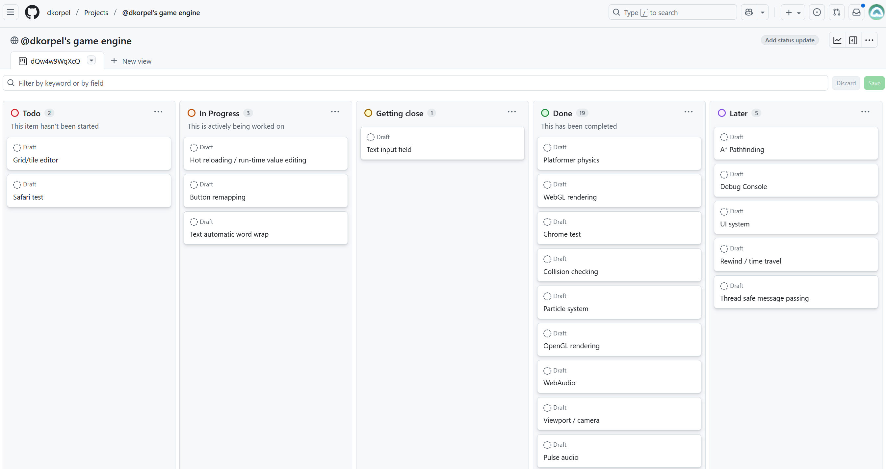

---

```
# Run `nix-shell` to use this development environment, 'exit' quit, 'nix-shell --run $SHELL' to update
with import <nixpkgs> {};
mkShell {
  buildInputs = [

    # Dependencies of the executable
    alsa-lib    # Kernel-level audio
    libGL       # Graphics
    pulseaudio  # Desktop manager-level audio
    xorg.libX11 # Window creation, input reading

    # Tools for building
    dmd        # build development builds
    ldc        # build release builds
    esbuild    # to minify javascript
    lld        # for wasm-ld
    wabt       # for wasm-strip
    gnumake    # make
    dub        # dub

    # Running a local HTTP server for WebAssembly
    python3
    pkgs.python3
    pkgs.python3Packages.websockets
```

---

```
    # Submitting to itch
    butler     # uploading to itch.io

    # The better shell (has zsh auto completions!)
    zsh

    # language servers
    serve-d  # D
    nil      # nix

    # Misc utilities
    git
    qoi        # convert images to qoi
    imagemagick_light # convert images
    ffmpeg     # convert audio
    lsof       # for testing if the local server is running
    coreutils  # for nohup, etc.
  ];
    shellHook = ''
    export LD_LIBRARY_PATH="$LD_LIBRARY_PATH:${lib.makeLibraryPath [ libGL pulseaudio xorg.libX11 ]}"
    exec zsh  # Automatically switch to zsh
  '';
}
```

---

# Tech stack

- object.d: custom WASM runtime (1000 lines, https://github.com/adamdruppe/webassembly)
- glfw-d: Windows/X11 window/input
- libsoundio-d: WASAPI / PulseAudio sound
- opengl.d: OpenGL bindings/utils (600 lines)
- webgl.js/gamecanvas.js glue (600 lines)
- collision.d: SAT / ray cast (300 lines)

---

```D
class Room {
    Entity[] entities;
}

class Entity 
{
    Vec3 position;

    void create();
    void step(); // fixed time step
    void draw(ref Mesh mesh);
    void drawGui(ref Mesh mesh);
}

class Player : Entity 
{
    override step() {...}
}
```

---

# Assets
- qoi.d: image format, .png alternative (300 lines, https://qoiformat.org/)
- qoa.d: audio format, .ogg alternative (500 lines, https://qoaformat.org/)
- ttf.d: font rendering (1000 lines, https://github.com/tomolt/libschrift)

---

# Issues

- code-d / Sublime on NixOS
- Engine developed as we go
- JavaScript `setInterval(..., 1000/60)` = 45 fps on Firefox + power saving
- `requestAnimationFrame(loop)` timer aliasing

```D
/// Hack to make i"" strings work, which import core.interpolation which references this symbol
pragma(mangle, "_D4core13interpolation16__getEmptyStringFNaNbNiNfZAya")
public string __getEmptyString() @nogc pure nothrow @safe => "";
```

---

# Issues

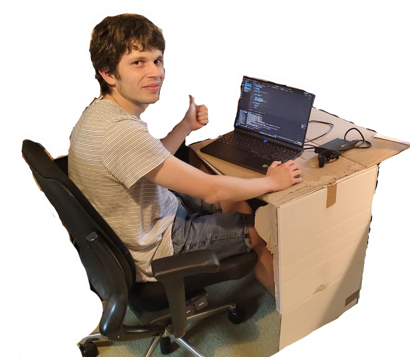

---

https://dennis0.itch.io/
