<style>
.titlebold {
  color: #e0c127ff;
  text-shadow: 4px 4px 6px rgba(0,0,0,0.6);
  font-size: 2.2em;
  font-weight:bold;
  text-align: center;

}
</style>

<br><br>
<h1 class="titlebold">Saying <b>NO</b> to save a language</h1>
<br><br>
Why adding features to the compiler is so hard

Dennis Korpel

<!--_header: -->
<!--_footer: DConf'25 London - August 19 2024 · Slides: https://github.com/dkorpel/dconf -->
<!--_paginate: hide-->

---
# The circle of life

* C++ committee says "No" to Walter Bright's proposals
* Walter creates D
* D Improvement Proposals (DIPs) are made
* Walter says "No"
* D users create new languages

---

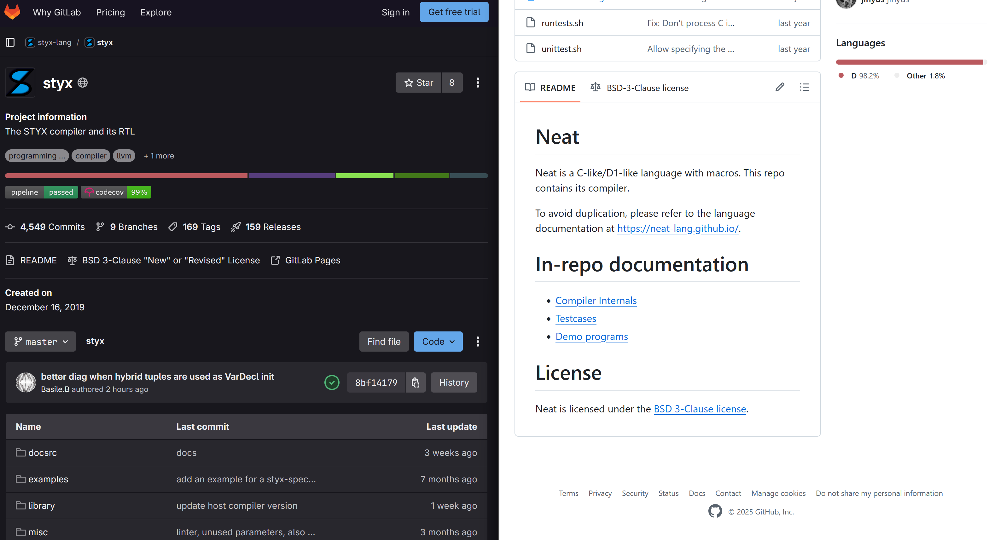
<!--_footer: Styx: https://gitlab.com/styx-lang/styx · Neat: https://github.com/neat-lang/neat -->

---
# Can't Walter just say yes?
<br>

<div style="display:flex; justify-content:center; gap:20px;">
  
  <span data-marpit-fragment="2">
  
  </span>
</div>

<!--_footer: Dr. No (1962) - United Artists · Yes Man (2008) - Warner Bros. Pictures -->

---
# About me

* Pull Request and Issue manager since 2022
* Want a small, stable programming language
* Also inclined to say

<span data-marpit-fragment="4">

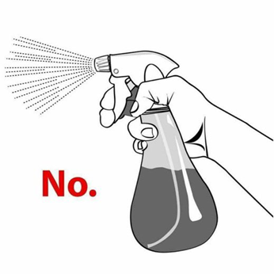
</span>

---
# Contents

* How features add complexity
* How to make better improvement proposals
* How to refactor code to reduce technical debt

---
# D is too complex

* Makes it harder to use/maintain
* How did it become this way?

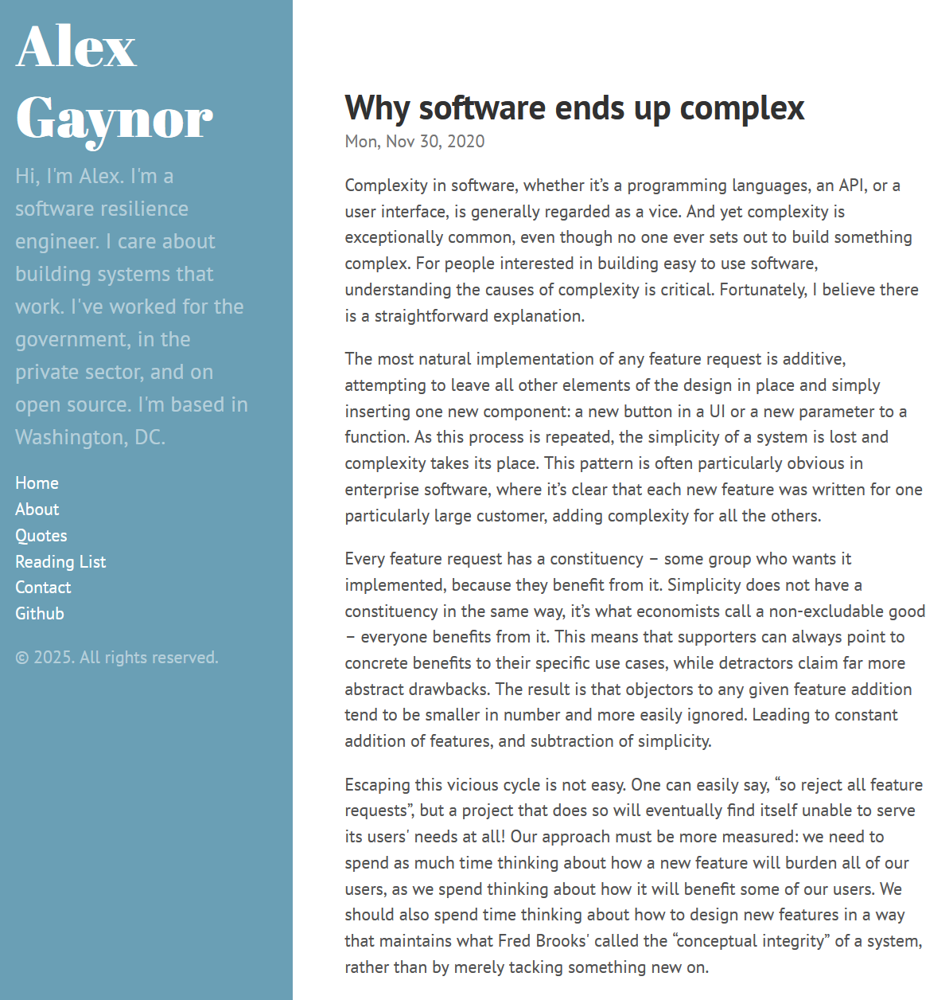

<!--_footer: https://alexgaynor.net/2020/nov/30/why-software-ends-up-complex/ -->

---

# Simplicity gets dismissed

* Features are naturally additive
* Supporters claim concrete benefits
* Detractors claim abstract drawbacks
  * Sounds like exaggerating
* Add 1% a hundred times and you triple the size
  * (Exponential growth)

---
# Not all compiler stages are equal

Parsing → Semantic Analysis → Code generation

* Parsing
  * ~10 KLOC in dmd, 'solved' problem
* Code generation
  * Outsourced to LLVM, GCC, or Walter Bright
  * ~100 KLOC in dmd
* Semantic analysis
  * ~200 KLOC, 'heart' of the D language

---
# "Semantic" is the trouble spot

<span data-marpit-fragment="1">But what is it?</span>


<!-- _footer: Pictured: ArcelorMittal Orbit-->

---
# It's tree rewriting

<style>
.code-art {
  font-family: monospace;
  font-size: 1.2em;
  line-height: 1.2;
  white-space: pre;
}
.code-art .slash { opacity: 0.25; }
.code-art .letter { color: #82b9ddff; }
.code-art .symbol { color: #e1877dff; }
.code-art .number { color: #5cad79ff; }
</style>

<pre class="code-art">
<span class="letter">x</span> <span class="symbol">+</span> <span class="letter">y</span> <span class="symbol">*</span> <span class="number">0</span>
</pre>

Tree form:

<pre class="code-art" data-marpit-fragment="1">
   <span class="symbol">+</span>                <span class="symbol">+</span>            <span class="letter">x</span>
  <span class="slash">/ \</span>              <span class="slash">/ \</span>
 <span class="letter">x</span>   <span class="symbol">*</span>      →     <span class="letter">x</span>   <span class="number">0</span>    →
    <span class="slash">/ \</span>
   <span class="letter">y</span>   <span class="number">0</span>
</pre>

---
# Just recursion and if-statements

```D
Expression semantic(Expression exp)
{
    exp.lhs = semantic(exp.lhs);
    exp.rhs = semantic(exp.rhs);

    if (exp.kind == MULTIPLICATION && exp.rhs == Expression(0))
        return Expression(0);

    if (exp.kind == ADDITION && exp.rhs == Expression(0))
        return exp.lhs;
}
```
<span data-marpit-fragment="1">...Multiplied by 20000</span>

---
# Example of implementation woes

- Command to run unittests for single module:
```bash
dmd -i -unittest -main -run foo.d
```

* `-unittest` only compiles in `unittest {}` functions
* `-main` implicitly adds `void main() {}`
* What if `foo.d` already has a `main`?
* `Error: only one main allowed`
* Enhancement request: only add empty main when needed

<!--_footer: https://github.com/dlang/dmd/pull/13057 -->

---
# Contributions become harder

* First question: How to find existing main?
  * In C, this could be a simple check in the parser
  * In D, consider `mixin` `static if (X)` `import`
* Parsing is too early
* Check for main in code generator?
  * Too late, backend is separate from frontend
* Another question: *what is `main`?*

---
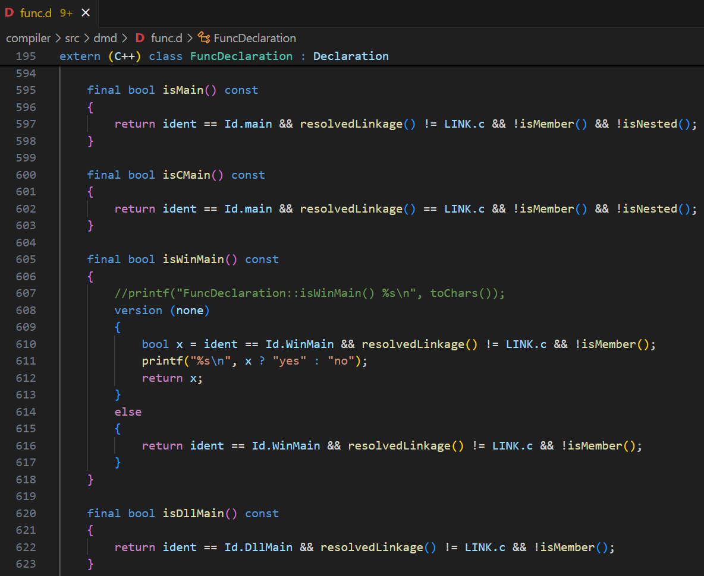

---
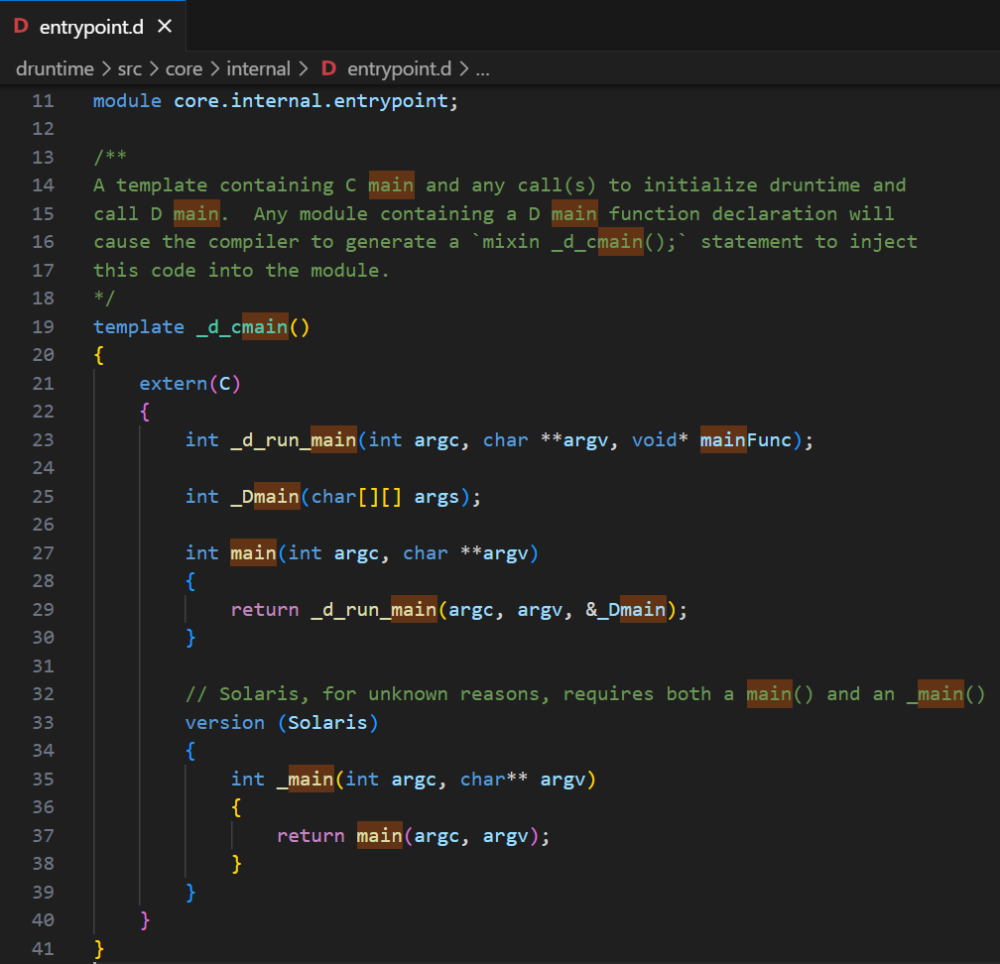

---
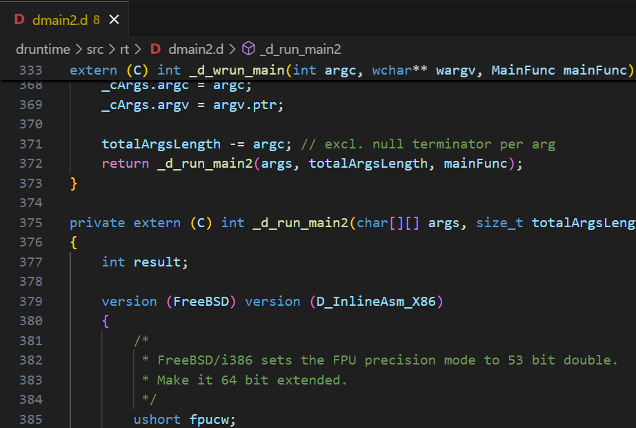

---
# Once it's in there, it stays

* Working on `final switch`-related code, I discovered:
  * switch case statement can be runtime `int` variable
  * `enum` can enumerate struct with `opBinary!"+"`
* Can we remove these please?
  * Breaks existing code

---
# All behaviors are depended on

Hyrum’s Law:

> With a sufficient number of users of an API, it does not matter what you promise in the contract: All observable behaviors of your system will be depended on by somebody.

* D exposes compiler internals (`.stringof`, `.mangleof`, etc.)
* D users unittest those internals
* Even `dmd -v` verbose [output depended on by `rdmd`](https://github.com/dlang/dmd/pull/20873)

<!--_footer: https://www.hyrumslaw.com/-->

---

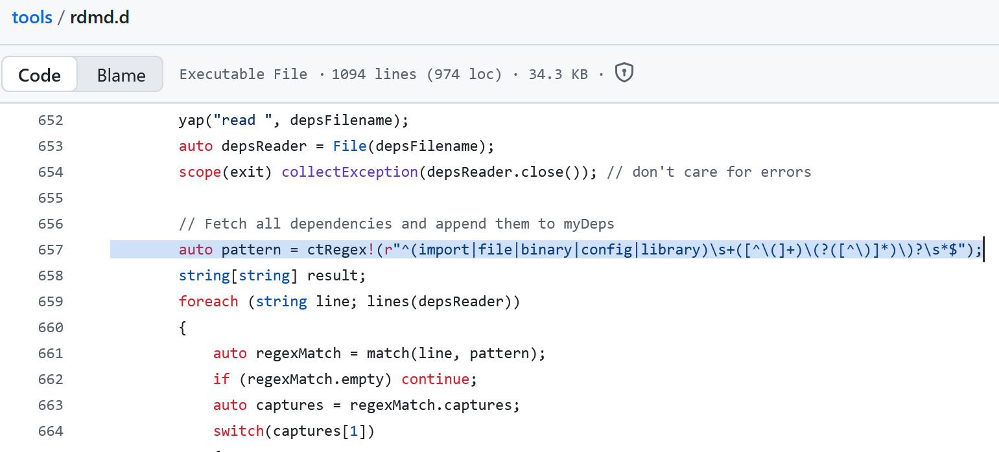
<!--_footer: https://github.com/dlang/tools/blob/4d4a2798b6f89befbdbc766b8284aae229c3c66b/rdmd.d#L657-->

---
## How features add complexity (conclusion)

* We add more than we remove
* Compiler development becomes harder/slower
* But: 'never add any features' is not a solution either

<span data-marpit-fragment="4">

> It's 2025, where are my tuples and sum types!

</span>

---

# 5 tips for improvement proposals


<!--_footer: Pictured: Battersea power station-->

---
# #1 - Include real usage examples

> Let's add magic `__REACHABLE__` boolean

* Why?
  * "For when you want to know whether code is reachable" 🤨
  * "Why not" ❌
  * Code example of usage in context ✅
  * GitHub link to production code that needs it ✅👍👏💯

---
# #2 - Inspire errors by real bugs

> Unreachable code is useless, it should be an error

* Have you considered: templates, conditional compilation, debugging, version control, dustmite...
* Yes, footguns like `if (x = 3)` exist
* But: removing composition = more complexity
  * Why is this combination useful? Let's ban it. ❌
  * GitHub/Forum links to bugs caused by this ✅

---
# #3 - Avoid warnings

> If an error won't do, we could make it a warning instead

* Warnings pile up, get drowned out

---

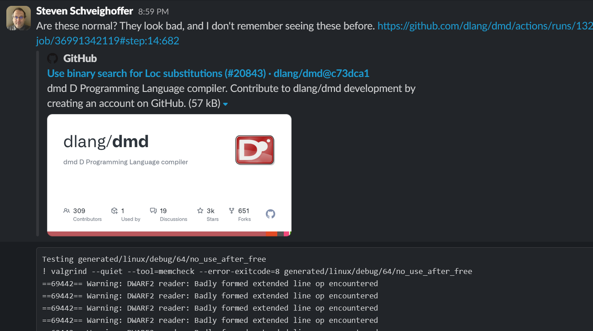

---
# #3 - Avoid warnings

> Then treat warnings as errors in 'production builds'

- Has its own problems with false positives, updates, etc.

```D
switch (x)
{
  ...
    case 1:
        abort();
        break; // ⚠️ unreachable code
  ...
}
```

---

# #4 - More options ≠ better

> Can't be bad to give users the option with `-fno-unreachable-code`

* Hot take: All command line switches are bugs
* Google Translate has 1 billion users
* So it must have *tons* of options?

<span data-marpit-fragment="3">

```bash
google-translate
  --fix-spelling
  --word-wrap-columns=80
  --oxford-comma
  --custom-substitutions="onigiri/jelly-donut"
```
</span>

---
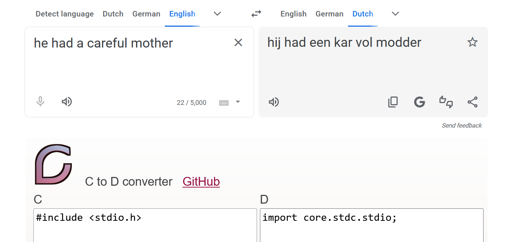
<!-- _footer: https://translate.google.com/ · https://dkorpel.github.io/ctod/-->

---

# #4 - More options ≠ better

- ctod used to have a `--strip-comments`

> Make each program do one thing well. To do a new job, build afresh rather than complicate old programs by adding new "features".

* Now it has 0 flags
* Viable for dmd?

<!-- _footer: https://archive.org/details/bstj57-6-1899/mode/2up -->

---

# #5 - Look for the root problem

- Often library solutions exist
* Disliked because:
  * Requires imports
  * Worse performance
  * Bad errors messages
  * Ugly syntax

---

# #5 - Look for the root problem

- Often library solutions exist
* Disliked because:
  * Requires imports (prelude modules?)
  * Worse performance (optimized debug builds?)
  * Bad errors messages (diagnostic message attributes?)
  * Ugly syntax (new operator overloading?)

---
# #5 - Look for the root problem

* Historical trends:
  * FORTRAN/COBOL → C/C++
  * Fixed graphics pipelines → shaders → GPGPU
  * Complex number type in C/D → SIMD, operator overloading
* Look for general building blocks

---

## Better improvement proposals (conclusion)

* Motivate by real world problems
* Find the root cause
* Offer a confident solution
  * warnings/options should be last resort

---

# Reducing technical debt

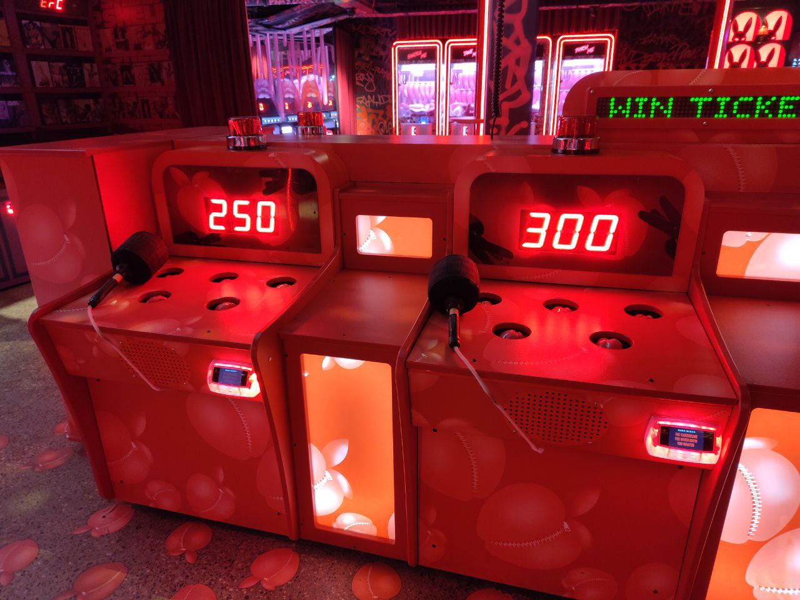
<!--_footer: Picture: Lane7 Camden, London - "Play Dirty"-->

---

# An unstable foundation supplies unlimited bug reports

* Whack-a-mole bug fixing
* `if (the_code == code_from_issue) do_the_desired_thing_instead()`
* Result: incpomplete, redundant solutions:
  * `ctfe`, `ctfeBlock`, `ctfeOnly`
  * `maybeScope`, `doNotInferScope`
* "The existing code was a hack, so I had to add my own hack"

---

# More passing test cases != progress

* Local optimum where common cases succeed
* Can be useful for experimentation
* At some point, sound solution must be found
* Wrong fixes must be undone

<!--_footer: Example of undoing a wrong fix: https://github.com/dlang/dmd/pull/13972-->

---

# Factor out common code

* Arithmetic operators type check almost identically
* Differences are often bugs
* Expression semantic for `>>>` and `>>` used to be copy-pasta

---
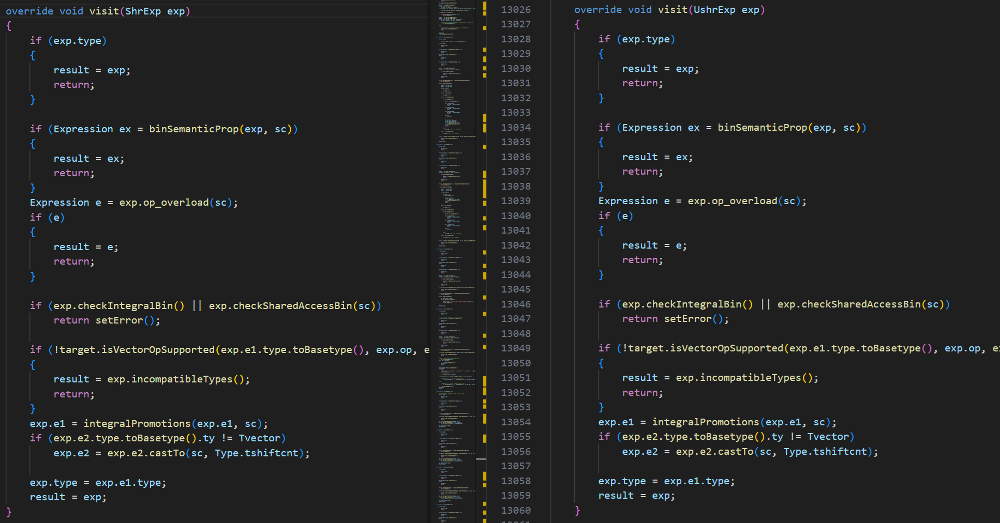

---
# Reuse isn't always correct

* Consider `bool hasPointers(Type t)`
  * `int` <span data-marpit-fragment="3">→ false</span>
  * `int*` <span data-marpit-fragment="4">→ true</span>
  * `struct S { int x; string y; }` <span data-marpit-fragment="5">→ true</span>
  * `void[8]` <span data-marpit-fragment="6">→ ?</span>
* Depends! Conservative GC scanning or `@safe` checks?

---
# Avoid boolean parameters

```D
bool hasPointers(Type t, bool usedForGcScanning)
{
    ...
    if (usedForGcScanning)
        if (t.kind == Tarray && t.next.kind == Tvoid)
            return true;
    ...
}
```

---

# Spaghetti ensues

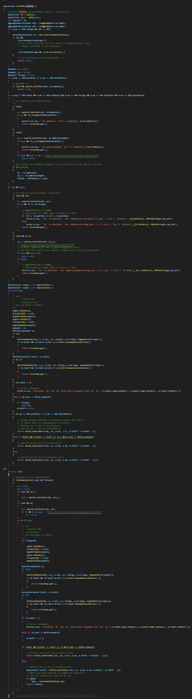

Semantic for `opAssign`, `opEquals`, `opBinary`, `opUnary`
  All funneled through 300 line `overload()` function

```D
if (e.op == EXP.plusPlus || e.op == EXP.minusMinus)
{
    // Bug4099 fix
    if (ad1 && search_function(ad1, Id.opUnary))
        return null;
}
if (e.op != EXP.equal && e.op != EXP.notEqual &&
    e.op != EXP.assign && e.op != EXP.plusPlus && e.op != EXP.minusMinus)
{
    // Try opBinary and opBinaryRight
}
```

---

# Cutting up doesn't help

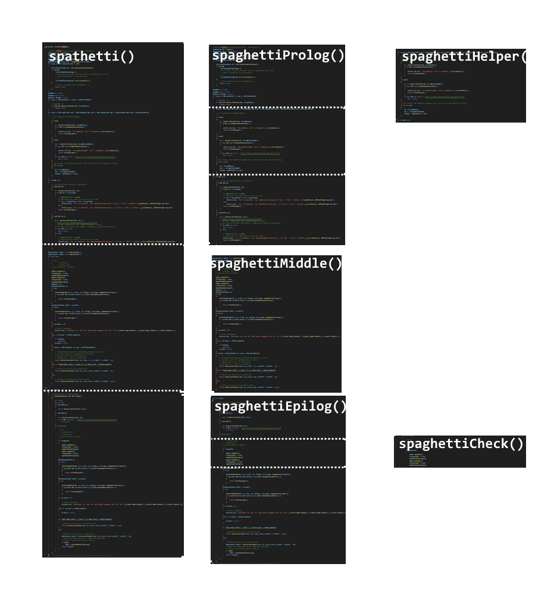

* Now you just have 5 incomprehensible functions
* Separate the code paths instead

---

```D
Expression overload(Expression e)
{
    string name = "opBinary";
    if (e.op == "==")
        name = "opEquals";

    auto result = new CallExpression(name);
    if (e.op != "==")
        result.addTemplateArgs([e.op]);

    result.addArgs([e.lhs, e.rhs]);
    return result;
}
```

---

```D
Expression overloadBinary(Expression e)
{
    string name = "opBinary";
    if (e.op == "==")
        name = "opEquals";

    auto result = new CallExpression(name);
    if (e.op != "==")
        result.addTemplateArgs([e.op]);

    result.addArgs([e.lhs, e.rhs]);
    return result;
}
```

---

```D
Expression overloadBinary(Expression e)
{
    string name = "opBinary";
    if (false)
        name = "opEquals";

    auto result = new CallExpression(name);
    if (true)
        result.addTemplateArgs([e.op]);

    result.addArgs([e.lhs, e.rhs]);
    return result;
}
```

---

```D
Expression overloadBinary(Expression e)
{
    string name = "opBinary";
    auto result = new CallExpression(name);
    if (true)
        result.addTemplateArgs([e.op]);

    result.addArgs([e.lhs, e.rhs]);
    return result;
}
```

---

```D
Expression overloadBinary(Expression e)
{
    string name = "opBinary";
    auto result = new CallExpression(name);

        result.addTemplateArgs([e.op]);

    result.addArgs([e.lhs, e.rhs]);
    return result;
}
```

---

```D
Expression overloadBinary(Expression e)
{
    string name = "opBinary";
    auto result = new CallExpression(name);
    result.addTemplateArgs([e.op]);
    result.addArgs([e.lhs, e.rhs]);
    return result;
}
```

---

```D
Expression overloadBinary(Expression e)
{
    string name = "opBinary";
    auto result = new CallExpression(name);
    result.addTemplateArgs([e.op]);
    result.addArgs([e.lhs, e.rhs]);
    return result;
}
```

---

```D
Expression overloadBinary(Expression e)
{
    auto result = new CallExpression("opBinary");
    result.addTemplateArgs([e.op]);
    result.addArgs([e.lhs, e.rhs]);
    return result;
}
```

<div data-marpit-fragment="1">

```D
Expression overloadEquals(Expression e)
{
    auto result = new CallExpression("opEquals");
    result.addArgs([e.lhs, e.rhs]);
    return result;
}
```
</div>

---

```D
Expression overloadBinary(Expression e)
{
    return callOpOverload("opBinary", [e.op], [e.lhs, e.rhs]);
}

Expression overloadEquals(Expression e)
{
    return callOpOverload("opEquals", [], [e.lhs, e.rhs]);
}

Expression callOpOverload(string name, Expression[] tiArgs, Expression[] args)
{
    auto result = new CallExpression(name);
    result.addTemplateArgs(tiArgs);
    result.addArg(args);
    return result;
}
```

---

```D
Expression overload(Expression e)
{
    string name = "opBinary";
    if (e.op == "==")
        name = "opEquals";

    auto result = new CallExpression(name);
    if (e.op != "==")
        result.addTemplateArgs([e.op]);

    result.addArg(e.lhs);
    result.addArg(e.rhs);
    return result;
}
```

---
## Reducing technical debt (conclusion)

* Code duplication and premature abstraction can both be bad
* When you can't get away with duct tape solutions:
  * **Expand** intertwined code paths
  * **Trim** dead branches
  * **Factor out** common code again

<!-- _footer: https://dlang.org/changelog/2.111.0.html#dmd.error-messages -->

---

# Takeaways

* There is a limited complexity budget for features
* Strong proposals spend little to solve real problems
* Pay off technical debt to expand your budget
* Don't take the "No" personal

---

# Questions?


